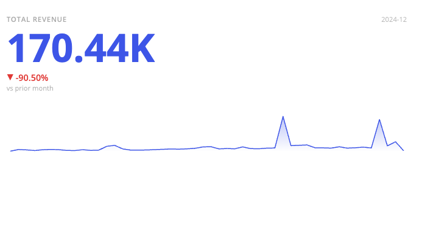

# Function KpiChart

> **KpiChart**(`props`): `Promise`\< `ReactNode` \> \| `ReactNode`

A React component that displays a single headline metric as a card, optionally with a
sparkline of its trend and a readout comparing it against a baseline.

Given just a measure, the card shows that number on its own. Adding a `category` — typically
a date dimension — gives it a sparkline and a caption for the period being shown. Adding a
`comparison` makes it also report how the metric moved: against the previous period, against
a second measure, or against a target.

## Parameters

| Parameter | Type | Description |
| :------ | :------ | :------ |
| `props` | [`KpiChartProps`](../interfaces/interface.KpiChartProps.md) | KPI chart properties |

## Returns

`Promise`\< `ReactNode` \> \| `ReactNode`

KPI Chart component

## Example

```ts
import { KpiChart } from '@sisense/sdk-ui';
import * as DM from './sample-ecommerce';
import { measureFactory } from '@sisense/sdk-data';

const CodeExample = () => {
  return (
    <KpiChart
      dataSet={DM.DataSource}
      dataOptions={{
        value: measureFactory.sum(DM.Commerce.Revenue, 'Total Revenue'),
        category: DM.Commerce.Date.Months,
        comparison: { type: 'previous-period' },
      }}
      styleOptions={{
        sparkline: { chartType: 'area' },
        height: 250,
      }}
    />
  );
};

export default CodeExample;
```


