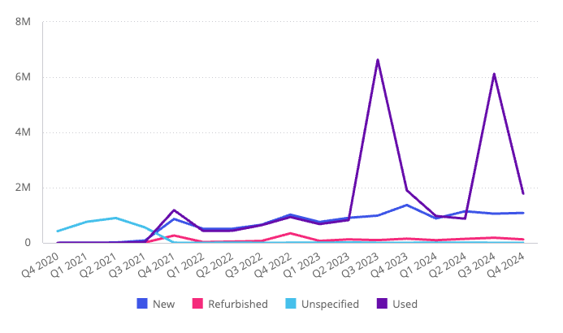
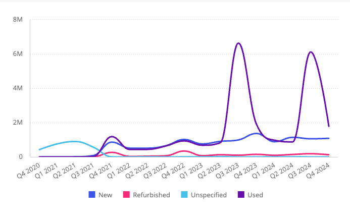
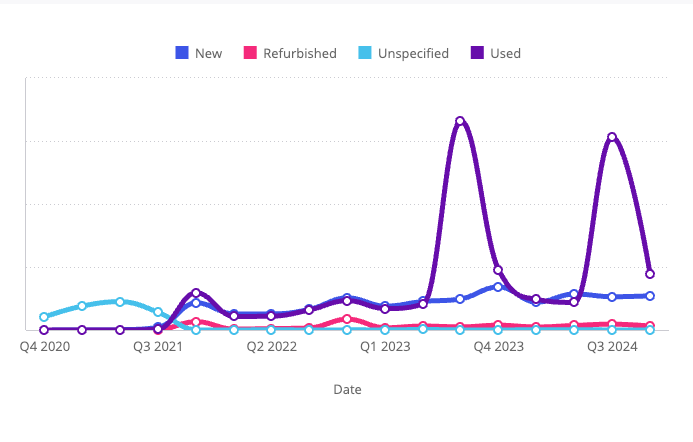
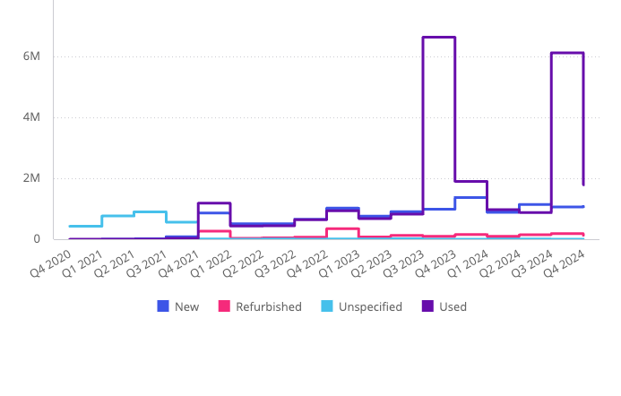

# Function LineChart

> **LineChart**(`props`): `Promise`\< `ReactNode` \> \| `ReactNode`

A React component displaying data as a series of points connected by a line. Used to show trends or changes over time.

## Parameters

| Parameter | Type | Description |
| :------ | :------ | :------ |
| `props` | [`LineChartProps`](../interfaces/interface.LineChartProps.md) | Line chart properties |

## Returns

`Promise`\< `ReactNode` \> \| `ReactNode`

Line Chart component

## Example

Line chart displaying total revenue per quarter from the Sample ECommerce data model.

```ts
import { LineChart } from '@sisense/sdk-ui';
import { measureFactory } from '@sisense/sdk-data';
import * as DM from './sample-ecommerce';

const CodeExample = () => (
  <LineChart
    dataSet={DM.DataSource}
    dataOptions={{
      category: [DM.Commerce.Date.Quarters],
      value: [measureFactory.sum(DM.Commerce.Revenue, 'Total Revenue')],
      breakBy: [DM.Commerce.Condition],
    }}
  />
);

export default CodeExample;
```



Curved (spline) line chart variant, using the same data:

```ts
<LineChart
  dataSet={DM.DataSource}
  dataOptions={{
    category: [DM.Commerce.Date.Quarters],
    value: [measureFactory.sum(DM.Commerce.Revenue, 'Total Revenue')],
    breakBy: [DM.Commerce.Condition],
  }}
  styleOptions={{ lineWidth: { width: 'bold' }, subtype: 'line/spline' }}
/>
```



Styled line chart variant with custom axes, legend, and markers:

```ts
<LineChart
  dataSet={DM.DataSource}
  dataOptions={{
    category: [DM.Commerce.Date.Quarters],
    value: [measureFactory.sum(DM.Commerce.Revenue, 'Total Revenue')],
    breakBy: [DM.Commerce.Condition],
  }}
  styleOptions={{
    lineWidth: { width: 'thick' },
    subtype: 'line/spline',
    yAxis: { enabled: true, labels: { enabled: false } },
    xAxis: { title: { enabled: true, text: 'Date' }, intervalJumps: 3, isIntervalEnabled: true },
    legend: { enabled: true, position: 'top' },
    markers: { enabled: true, size: 'small', fill: 'hollow' },
  }}
/>
```



Step line chart variant, using the same data:

```ts
<LineChart
  dataSet={DM.DataSource}
  dataOptions={{
    category: [DM.Commerce.Date.Quarters],
    value: [measureFactory.sum(DM.Commerce.Revenue, 'Total Revenue')],
    breakBy: [DM.Commerce.Condition],
  }}
  styleOptions={{ lineWidth: { width: 'bold' }, subtype: 'line/step', stepPosition: 'left' }}
/>
```


