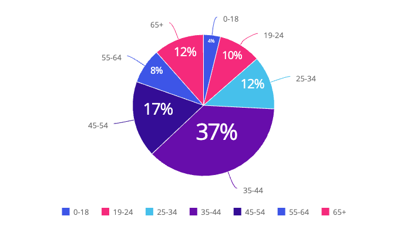
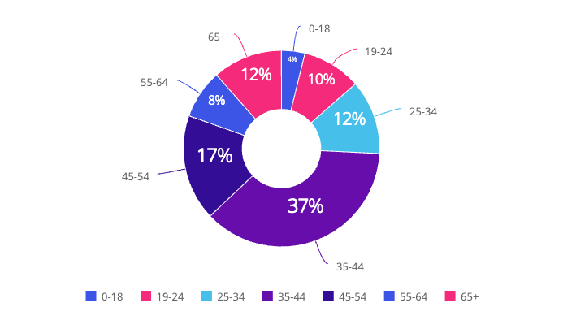
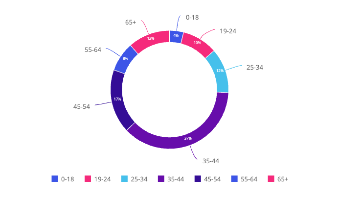

# Function PieChart

> **PieChart**(`props`): `Promise`\< `ReactNode` \> \| `ReactNode`

A React component representing data in a circular graph with the data shown as slices of a whole,
with each slice representing a proportion of the total.

## Parameters

| Parameter | Type | Description |
| :------ | :------ | :------ |
| `props` | [`PieChartProps`](../interfaces/interface.PieChartProps.md) | Pie chart properties |

## Returns

`Promise`\< `ReactNode` \> \| `ReactNode`

Pie Chart component

## Example

Pie chart displaying total revenue per age range from the Sample ECommerce data model.

```ts
import { PieChart } from '@sisense/sdk-ui';
import { measureFactory } from '@sisense/sdk-data';
import * as DM from './sample-ecommerce';

const CodeExample = () => (
  <PieChart
    dataSet={DM.DataSource}
    dataOptions={{
      category: [DM.Commerce.AgeRange],
      value: [measureFactory.sum(DM.Commerce.Revenue, 'Total Revenue')],
    }}
    styleOptions={{ subtype: 'pie/classic' }}
  />
);

export default CodeExample;
```



Donut chart variant, using the same data:

```ts
<PieChart
  dataSet={DM.DataSource}
  dataOptions={{
    category: [DM.Commerce.AgeRange],
    value: [measureFactory.sum(DM.Commerce.Revenue, 'Total Revenue')],
  }}
  styleOptions={{ subtype: 'pie/donut' }}
/>
```



Ring chart variant, using the same data:

```ts
<PieChart
  dataSet={DM.DataSource}
  dataOptions={{
    category: [DM.Commerce.AgeRange],
    value: [measureFactory.sum(DM.Commerce.Revenue, 'Total Revenue')],
  }}
  styleOptions={{ subtype: 'pie/ring' }}
/>
```


