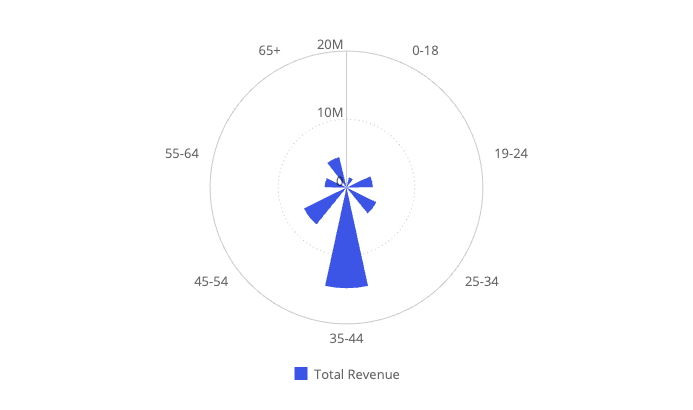
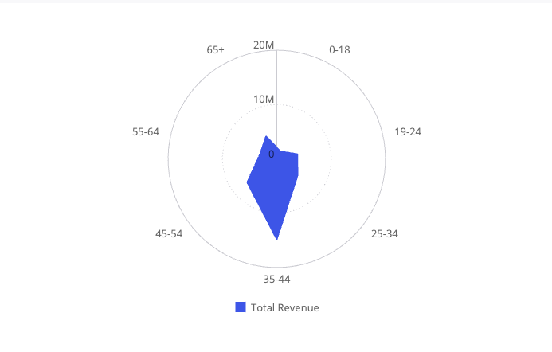
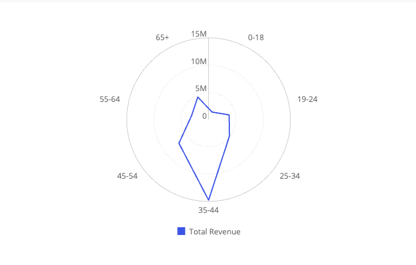

# Function PolarChart

> **PolarChart**(`props`): `Promise`\< `ReactNode` \> \| `ReactNode`

A React component comparing multiple categories/variables with a spatial perspective in a radial chart.

## Parameters

| Parameter | Type | Description |
| :------ | :------ | :------ |
| `props` | [`PolarChartProps`](../interfaces/interface.PolarChartProps.md) | Polar chart properties |

## Returns

`Promise`\< `ReactNode` \> \| `ReactNode`

Polar Chart component

## Example

Polar chart displaying total revenue per age range from the Sample ECommerce data model.

```ts
import { PolarChart } from '@sisense/sdk-ui';
import { measureFactory } from '@sisense/sdk-data';
import * as DM from './sample-ecommerce';

const CodeExample = () => (
  <PolarChart
    dataSet={DM.DataSource}
    dataOptions={{
      category: [DM.Commerce.AgeRange],
      value: [measureFactory.sum(DM.Commerce.Revenue, 'Total Revenue')],
      breakBy: [],
    }}
  />
);

export default CodeExample;
```



Area polar chart variant, using the same data:

```ts
<PolarChart
  dataSet={DM.DataSource}
  dataOptions={{
    category: [DM.Commerce.AgeRange],
    value: [measureFactory.sum(DM.Commerce.Revenue, 'Total Revenue')],
    breakBy: [],
  }}
  styleOptions={{ subtype: 'polar/area' }}
/>
```



Line polar chart variant, using the same data:

```ts
<PolarChart
  dataSet={DM.DataSource}
  dataOptions={{
    category: [DM.Commerce.AgeRange],
    value: [measureFactory.sum(DM.Commerce.Revenue, 'Total Revenue')],
    breakBy: [],
  }}
  styleOptions={{ subtype: 'polar/line' }}
/>
```


