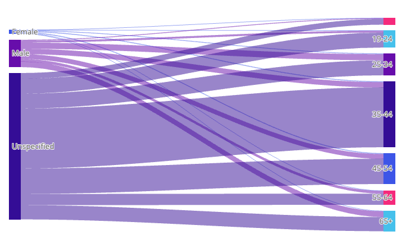

# Function SankeyChart

> **SankeyChart**(`props`): `Promise`\< `ReactNode` \> \| `ReactNode`

A React component that visualizes flow and volume between nodes using a Sankey diagram.
Node width represents the total flow through that node; link width represents the flow
between two connected nodes.

## Parameters

| Parameter | Type | Description |
| :------ | :------ | :------ |
| `props` | [`SankeyChartProps`](../interfaces/interface.SankeyChartProps.md) | Sankey chart properties |

## Returns

`Promise`\< `ReactNode` \> \| `ReactNode`

Sankey Chart component

## Example

```ts
import { SankeyChart } from '@sisense/sdk-ui';
import * as DM from './sample-ecommerce';
import { measureFactory } from '@sisense/sdk-data';

const CodeExample = () => {
  return (
    <SankeyChart
      dataSet={DM.DataSource}
      dataOptions={{
        category: [DM.Commerce.Gender, DM.Commerce.AgeRange],
        value: measureFactory.sum(DM.Commerce.Revenue),
      }}
      styleOptions={{
        orientation: 'horizontal',
        nodeAlignment: 'top',
      }}
    />
  );
};

export default CodeExample;
```


