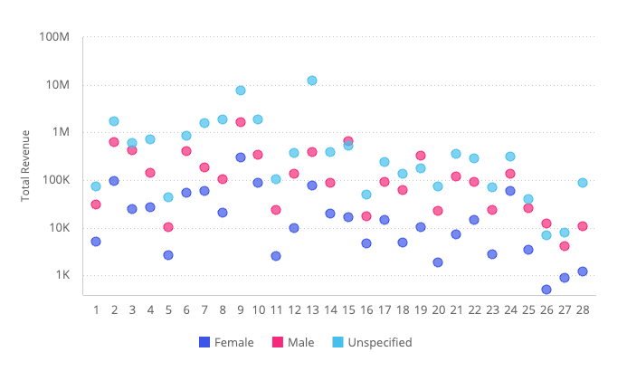
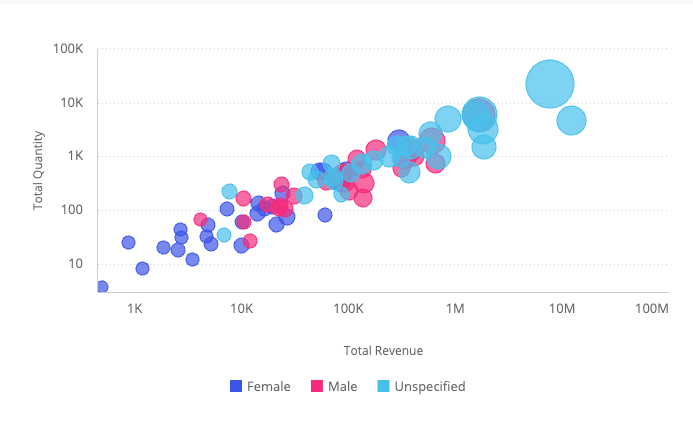

# Function ScatterChart

> **ScatterChart**(`props`): `Promise`\< `ReactNode` \> \| `ReactNode`

A React component displaying the distribution of two variables on an X-Axis, Y-Axis,
and two additional fields of data that are shown as colored circles scattered across the chart.

**Point**: A field that for each of its members a scatter point is drawn. The maximum amount of data points is 500.

**Size**: An optional field represented by the size of the circles.
If omitted, all scatter points are equal in size. If used, the circle sizes are relative to their values.

## Parameters

| Parameter | Type | Description |
| :------ | :------ | :------ |
| `props` | [`ScatterChartProps`](../interfaces/interface.ScatterChartProps.md) | Scatter chart properties |

## Returns

`Promise`\< `ReactNode` \> \| `ReactNode`

Scatter Chart component

## Example

Scatter chart displaying total revenue per category, broken down by gender, from the Sample ECommerce data model.

```ts
import { ScatterChart } from '@sisense/sdk-ui';
import { measureFactory } from '@sisense/sdk-data';
import * as DM from './sample-ecommerce';

const CodeExample = () => (
  <ScatterChart
    dataSet={DM.DataSource}
    dataOptions={{
      x: DM.Category.CategoryID,
      y: measureFactory.sum(DM.Commerce.Revenue),
      breakByColor: DM.Commerce.Gender,
    }}
    styleOptions={{
      yAxis: { enabled: true, logarithmic: true, title: { enabled: true, text: 'Total Revenue' } },
    }}
  />
);

export default CodeExample;
```



Bubble chart variant, using point size and color to encode two additional fields:

```ts
<ScatterChart
  dataSet={DM.DataSource}
  dataOptions={{
    x: measureFactory.sum(DM.Commerce.Revenue),
    y: measureFactory.sum(DM.Commerce.Quantity),
    breakByPoint: DM.Category.Category,
    breakByColor: DM.Commerce.Gender,
    size: measureFactory.sum(DM.Commerce.Cost),
  }}
  styleOptions={{
    xAxis: { enabled: true, logarithmic: true, title: { enabled: true, text: 'Total Revenue' } },
    yAxis: { enabled: true, logarithmic: true, title: { enabled: true, text: 'Total Quantity' } },
  }}
/>
```


