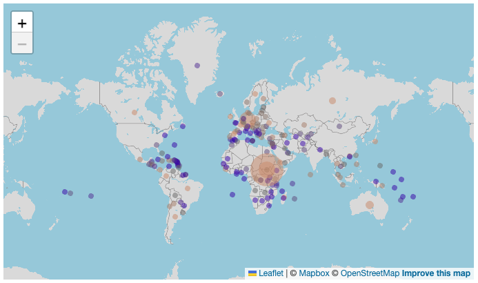

# Function ScattermapChart

> **ScattermapChart**(`props`): `Promise`\< `ReactNode` \> \| `ReactNode`

A React component that allows to visualize geographical data as data points on a map.

## Parameters

| Parameter | Type | Description |
| :------ | :------ | :------ |
| `props` | [`ScattermapChartProps`](../interfaces/interface.ScattermapChartProps.md) | Scattermap chart properties |

## Returns

`Promise`\< `ReactNode` \> \| `ReactNode`

Scattermap Chart component

## Example

Scatter map chart displaying cost and revenue rank from the Sample ECommerce data model. The cost is indicated by size of each point and the revenue rank is indicated by the point's size.

```ts
import { ScattermapChart } from '@sisense/sdk-ui';
import { measureFactory } from '@sisense/sdk-data';
import * as DM from './sample-ecommerce';

const CodeExample = () => (
  <ScattermapChart
    dataSet={DM.DataSource}
    dataOptions={{
      geo: [DM.Country.Country],
      size: measureFactory.sum(DM.Commerce.Cost, 'Size by Cost'),
      colorBy: {
        column: measureFactory.rank(measureFactory.sum(DM.Commerce.Revenue, 'Color by Revenue Rank')),
        color: { type: 'range', steps: 7, minColor: '#cf9270', maxColor: '#3900b3' },
      },
      details: DM.Brand.Brand,
    }}
  />
);

export default CodeExample;
```


