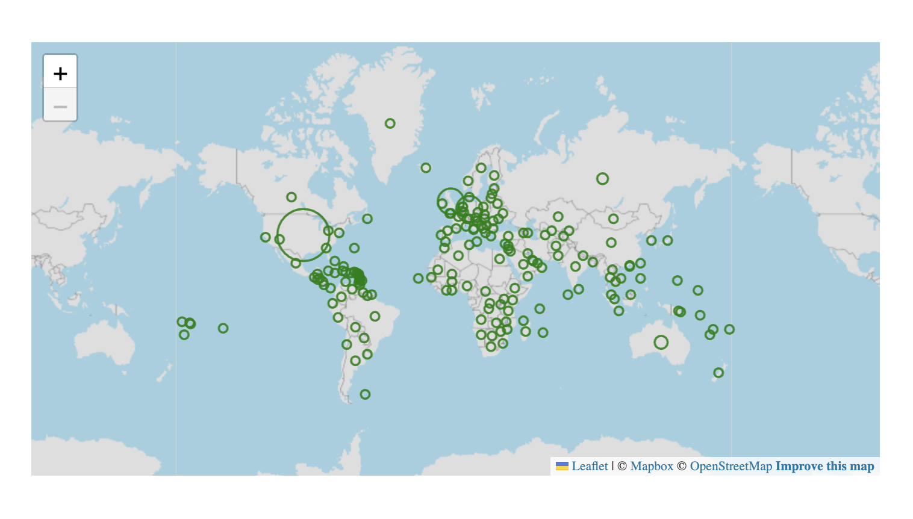

# Function ScattermapChart <Badge type="beta" text="Beta" />

> **ScattermapChart**(`props`, `context`?): `null` \| `ReactElement`\< `any`, `any` \>

A React component that allows to visualize geographical data as data points on a map.
See [Scattermap Chart](https://docs.sisense.com/main/SisenseLinux/scatter-map.htm) for more information.

## Parameters

| Parameter | Type | Description |
| :------ | :------ | :------ |
| `props` | [`ScattermapChartProps`](../interfaces/interface.ScattermapChartProps.md) | Scattermap chart properties |
| `context`? | `any` | - |

## Returns

`null` \| `ReactElement`\< `any`, `any` \>

Scattermap Chart component

## Example

An example of using the component to visualize the `Sample ECommerce` data source:
```ts
<ScattermapChart
  dataSet={DM.DataSource}
  dataOptions={{
    locations: [DM.Country.Country],
    size: measureFactory.sum(DM.Commerce.Cost, 'Size by Cost'),
    colorBy: {
      column: measureFactory.sum(DM.Commerce.Revenue, 'Color by Revenue'),
      color: 'green'
    },
    details: DM.Category.Category,
  }}
  styleOptions={{
    markers: {
      fill: 'hollow-bold'
    }
  }}
/>
```


