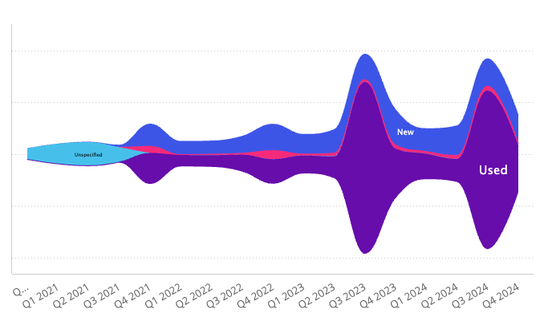
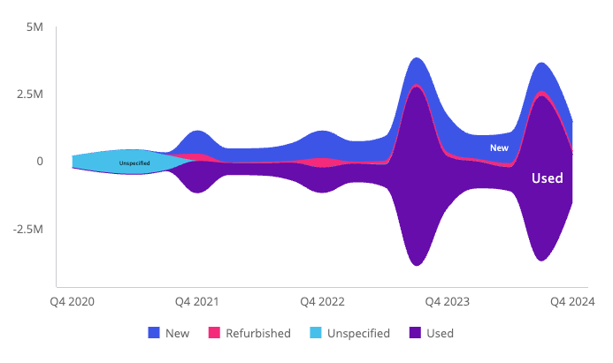

# Function StreamgraphChart

> **StreamgraphChart**(`props`): `Promise`\< `ReactNode` \> \| `ReactNode`

A React component that displays a streamgraph chart.

A streamgraph is a type of stacked area chart where areas are displaced around
a central axis. It is particularly effective for displaying volume across
different categories or over time with a relative scale that emphasizes
overall patterns and trends.

## Parameters

| Parameter | Type | Description |
| :------ | :------ | :------ |
| `props` | [`StreamgraphChartProps`](../interfaces/interface.StreamgraphChartProps.md) | Streamgraph chart properties |

## Returns

`Promise`\< `ReactNode` \> \| `ReactNode`

Streamgraph Chart component

## Example

```ts
import { StreamgraphChart } from '@sisense/sdk-ui';
import * as DM from './sample-ecommerce';
import { measureFactory } from '@sisense/sdk-data';

const CodeExample = () => {
  return (
    <StreamgraphChart
      dataSet={DM.DataSource}
      dataOptions={{
        category: [DM.Commerce.Date.Quarters],
        value: [measureFactory.sum(DM.Commerce.Revenue, 'Total Revenue')],
        breakBy: [DM.Commerce.Condition],
      }}
    />
  );
};

export default CodeExample;
```



Additional examples:

Styled with a visible y-axis, thinned-out x-axis labels, and a legend:
```ts
import { StreamgraphChart } from '@sisense/sdk-ui';
import * as DM from './sample-ecommerce';
import { measureFactory } from '@sisense/sdk-data';

const CodeExample = () => {
  return (
    <StreamgraphChart
      dataSet={DM.DataSource}
      dataOptions={{
        category: [DM.Commerce.Date.Quarters],
        value: [measureFactory.sum(DM.Commerce.Revenue, 'Total Revenue')],
        breakBy: [DM.Commerce.Condition],
      }}
      styleOptions={{
        yAxis: {
          enabled: true,
          labels: { enabled: true },
          gridLines: false,
        },
        xAxis: {
          intervalJumps: 4,
          isIntervalEnabled: true,
        },
        legend: { enabled: true },
      }}
    />
  );
};

export default CodeExample;
```


