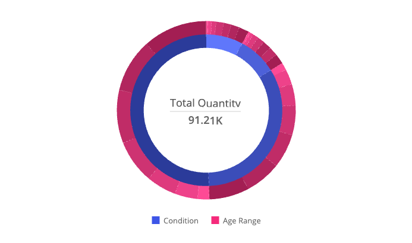

# Function SunburstChart

> **SunburstChart**(`props`): `Promise`\< `ReactNode` \> \| `ReactNode`

A React component displaying hierarchical data in the form of nested circle slices.

This type of chart can be used in different scenarios, for example, to compare both categories and sub-categories.

## Parameters

| Parameter | Type | Description |
| :------ | :------ | :------ |
| `props` | [`SunburstChartProps`](../interfaces/interface.SunburstChartProps.md) | Sunburst chart properties |

## Returns

`Promise`\< `ReactNode` \> \| `ReactNode`

Sunburst Chart component

## Example

Sunburst chart displaying total quantity, categorized by condition and age range, from the Sample ECommerce data model.

```ts
import { SunburstChart } from '@sisense/sdk-ui';
import { measureFactory } from '@sisense/sdk-data';
import * as DM from './sample-ecommerce';

const CodeExample = () => (
  <SunburstChart
    dataSet={DM.DataSource}
    dataOptions={{
      category: [DM.Commerce.Condition, DM.Commerce.AgeRange],
      value: [measureFactory.sum(DM.Commerce.Quantity, 'Total Quantity')],
    }}
  />
);

export default CodeExample;
```


