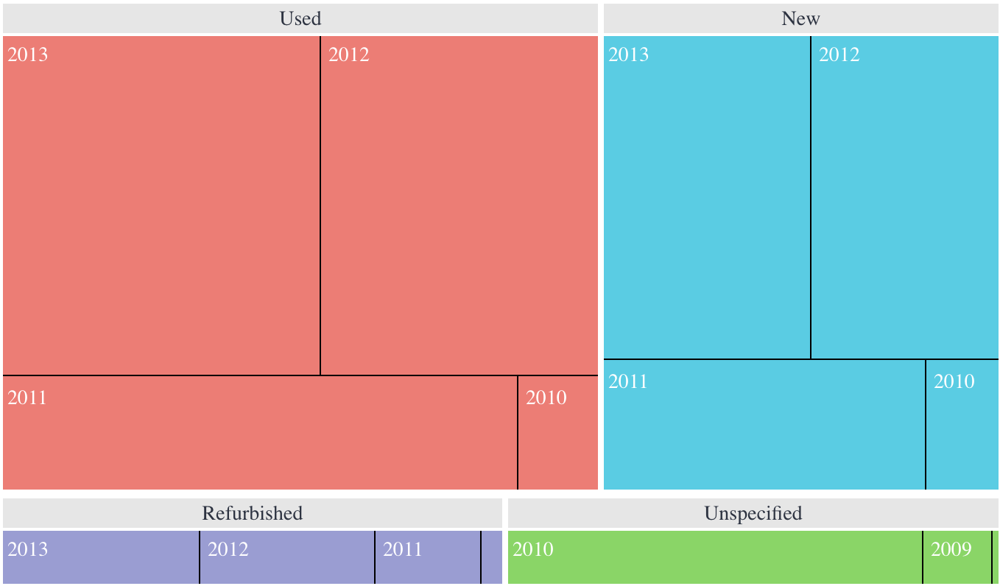

# Function TreemapChart

> **TreemapChart**(`props`, `context`?): `null` \| `ReactElement`\< `any`, `any` \>

A React component displaying hierarchical data in the form of nested rectangles.
This type of chart can be used instead of a column chart for comparing a large number of categories and sub-categories.
See [Treemap Chart](https://docs.sisense.com/main/SisenseLinux/treemap.htm) for more information.

## Parameters

| Parameter | Type | Description |
| :------ | :------ | :------ |
| `props` | [`TreemapChartProps`](../interfaces/interface.TreemapChartProps.md) | Treemap chart properties |
| `context`? | `any` | - |

## Returns

`null` \| `ReactElement`\< `any`, `any` \>

Treemap Chart component

## Example

An example of using the component to visualize the `Sample ECommerce` data source:
```ts
<TreemapChart
  dataSet={DM.DataSource}
  dataOptions={{
    category: [
       {
         column: DM.Commerce.Condition,
         isColored: true,
       },
       DM.Commerce.Date.Years
     ],
    value: [measureFactory.sum(DM.Commerce.Quantity)],
  }}
  onDataPointClick= {(point, nativeEvent) => {
    console.log('clicked', point, nativeEvent);
  }}
/>
```


