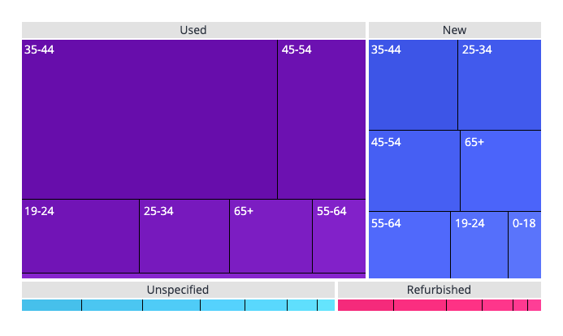

# Function TreemapChart

> **TreemapChart**(`props`): `Promise`\< `ReactNode` \> \| `ReactNode`

A React component displaying hierarchical data in the form of nested rectangles.

This type of chart can be used instead of a column chart for comparing a large number of categories and sub-categories.

## Parameters

| Parameter | Type | Description |
| :------ | :------ | :------ |
| `props` | [`TreemapChartProps`](../interfaces/interface.TreemapChartProps.md) | Treemap chart properties |

## Returns

`Promise`\< `ReactNode` \> \| `ReactNode`

Treemap Chart component

## Example

Tree map chart displaying total revenue, categorized by condition and age range, from the Sample ECommerce data model.

```ts
import { TreemapChart } from '@sisense/sdk-ui';
import { measureFactory } from '@sisense/sdk-data';
import * as DM from './sample-ecommerce';

const CodeExample = () => (
  <TreemapChart
    dataSet={DM.DataSource}
    dataOptions={{
      category: [{ column: DM.Commerce.Condition, isColored: true }, DM.Commerce.AgeRange],
      value: [measureFactory.sum(DM.Commerce.Revenue)],
    }}
  />
);

export default CodeExample;
```


