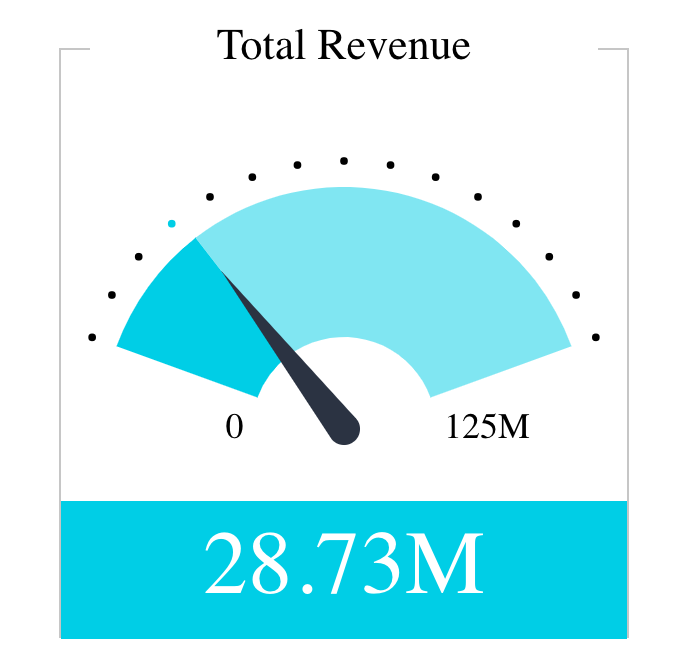

# Function ThemeProvider

> **ThemeProvider**(`props`): `ReactElement`\< `any`, `any` \> \| `null`

Theme provider, which allows you to adjust the look and feel of child components.

Components not wrapped in a theme provider use the current theme from the connected Fusion instance by default.

## Parameters

| Parameter | Type | Description |
| :------ | :------ | :------ |
| `props` | [`ThemeProviderProps`](../type-aliases/type-alias.ThemeProviderProps.md) | Theme provider props |

## Returns

`ReactElement`\< `any`, `any` \> \| `null`

A Theme Provider component

## Example

Example of a theme provider, which changes the colors and font of the nested indicator chart:
```ts
<ThemeProvider
  theme={{
    chart: {
      backgroundColor: '#333333',
      textColor: 'orange',
      secondaryTextColor: 'purple',
    },
    typography: {
      fontFamily: 'impact',
    },
  }}
>
  <IndicatorChart {...chartOptions} />
</ThemeProvider>
```

Indicator chart with custom theme settings:


For comparison, indicator chart with default theme settings:



## See

[ThemeSettings](../interfaces/interface.ThemeSettings.md) and IndicatorChart
