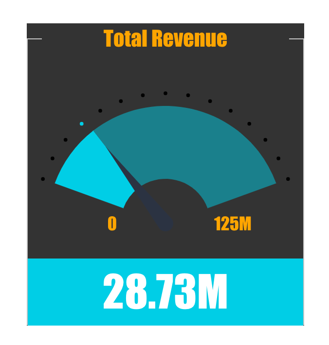

# Function ThemeProvider

> **ThemeProvider**(`props`, `deprecatedLegacyContext`?): `null` \| `ReactElement`\< `any`, `any` \>

Theme provider, which allows you to adjust the look and feel of child components.

## Parameters

| Parameter | Type | Description |
| :------ | :------ | :------ |
| `props` | [`ThemeProviderProps`](../type-aliases/type-alias.ThemeProviderProps.md) | Theme provider props |
| `deprecatedLegacyContext`? | `any` | ::: warning Deprecated<br /><br />:::<br /><br />**See**<br /><br />[React Docs](https://legacy.reactjs.org/docs/legacy-context.html#referencing-context-in-lifecycle-methods) |

## Returns

`null` \| `ReactElement`\< `any`, `any` \>

A Theme Provider component

## Example

Example of a theme provider, which changes the colors and font of the nested indicator chart:
```ts
<ThemeProvider
  theme={{
    chart: {
      backgroundColor: '#333333',
      textColor: 'orange',
      secondaryTextColor: 'purple',
    },
    typography: {
      fontFamily: 'impact',
    },
  }}
>
  <IndicatorChart {...chartOptions} />
</ThemeProvider>
```

Indicator chart with custom theme settings:



For comparison, indicator chart with default theme settings:


## See

[ThemeSettings](../interfaces/interface.ThemeSettings.md) and IndicatorChart
