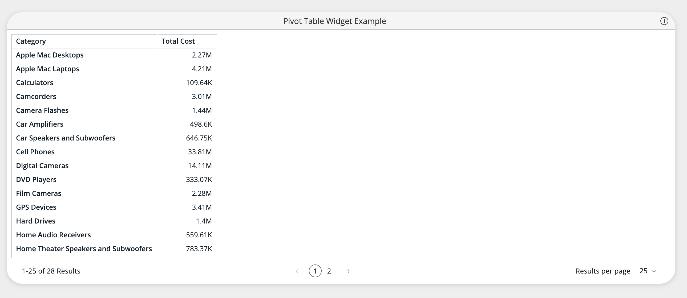

# Function PivotTableWidget

> **PivotTableWidget**(`props`): `ReactElement`\< `any`, `any` \> \| `null`

React component extending `PivotTable` to support widget style options.

## Parameters

| Parameter | Type | Description |
| :------ | :------ | :------ |
| `props` | [`PivotTableWidgetProps`](../interfaces/interface.PivotTableWidgetProps.md) | Pivot Table Widget properties |

## Returns

`ReactElement`\< `any`, `any` \> \| `null`

Widget component representing a pivot table

## Example

Example of using the `PivotTableWidget` component to
plot a pivot table over the `Sample ECommerce` data source hosted in a Sisense instance.
```ts
<PivotTableWidget
  dataSource={DM.DataSource}
  dataOptions={{
    rows: [DM.Category.Category],
    values: [measureFactory.sum(DM.Commerce.Cost, 'Total Cost')]
  }}
  title="Pivot Table Widget Example"
  styleOptions={{
    spaceAround: 'Medium',
    cornerRadius: 'Large',
    shadow: 'Light',
    border: true,
    borderColor: '#e0e0e0',
    backgroundColor: '#ffffff',
    header: {
      hidden: false,
      titleTextColor: '#333333',
      titleAlignment: 'Center',
      dividerLine: true,
      dividerLineColor: '#e0e0e0',
      backgroundColor: '#f5f5f5'
    }
  }}
/>
```

