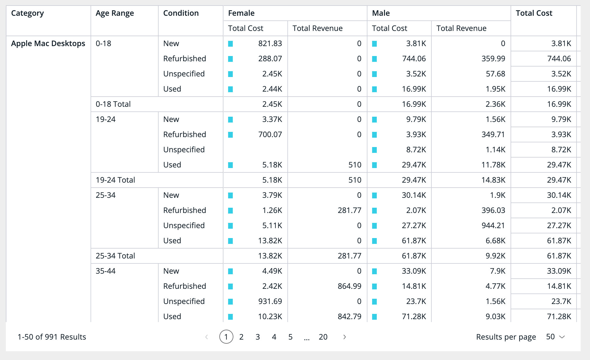
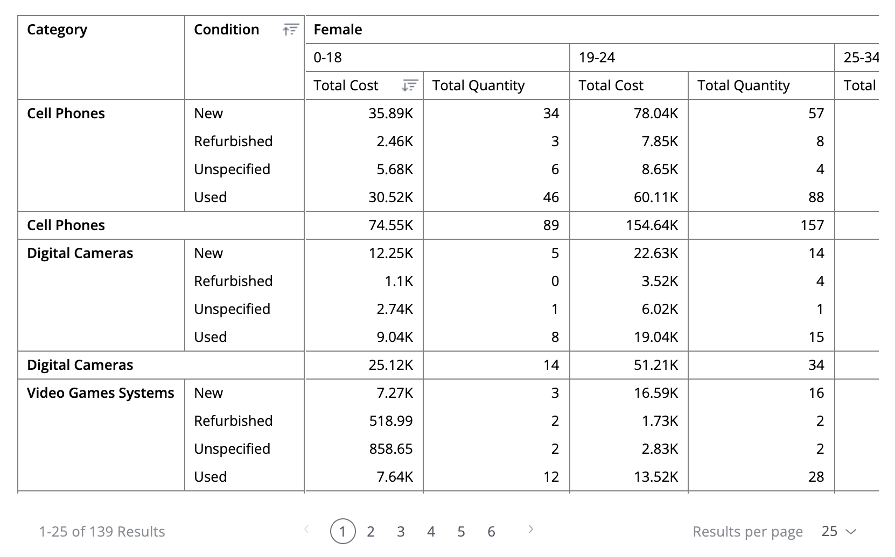
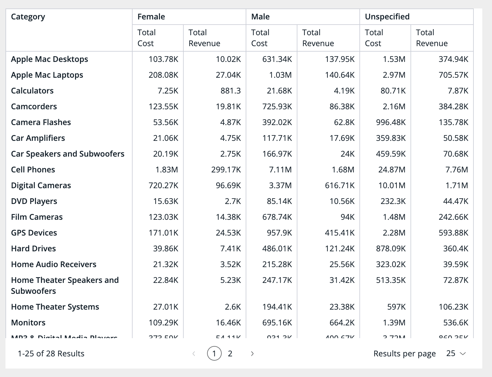

# Function PivotTable

> **PivotTable**(`props`): `ReactElement`\< `any`, `any` \> \| `null`

Pivot table with pagination.

## Parameters

| Parameter | Type | Description |
| :------ | :------ | :------ |
| `props` | [`PivotTableProps`](../interfaces/interface.PivotTableProps.md) | Pivot Table properties |

## Returns

`ReactElement`\< `any`, `any` \> \| `null`

Pivot Table component

## Example

(1) Example of PivotTable from the `Sample ECommerce` data model:

```ts
<PivotTable
  dataSet={DM.DataSource}
  dataOptions={{
    rows: [
      { column: DM.Category.Category, includeSubTotals: true },
      { column: DM.Commerce.AgeRange, includeSubTotals: true },
      DM.Commerce.Condition,
    ],
    columns: [{ column: DM.Commerce.Gender, includeSubTotals: true }],
    values: [
      {
        column: measureFactory.sum(DM.Commerce.Cost, 'Total Cost'),
        dataBars: true,
        totalsCalculation: 'sum',
      },
      {
        column: measureFactory.sum(DM.Commerce.Revenue, 'Total Revenue'),
        totalsCalculation: 'sum',
      },
    ],
    grandTotals: { rows: true, columns: true },
  }}
  filters={[filterFactory.members(DM.Commerce.Gender, ['Female', 'Male'])]}
  styleOptions={{ width: 1000, height: 600, rowsPerPage: 50 }}
/>
```


(2) Example of PivotTable with the predefined sorting configuration:
- Sort "Condition" row by its values in Ascending order. This is equivalent to users clicking on the "Condition" row heading and hit Sort Ascending (A-Z)
- Sort "Category" row by "Total Cost" values under the "columns" values of "Female" (for Gender) and "0-18" (for AgeRange) in Descending order.
This is equivalent to users clicking on the "Total Cost" value heading under "Female" (for Gender) and "0-18" (for AgeRange) and sort "Category (Subtotals)" in Descending (9-1)

```ts
<PivotTable
  dataSet={DM.DataSource}
  dataOptions={{
    rows: [
      {
        column: DM.Category.Category,
        includeSubTotals: true,
        sortType: {
          direction: 'sortDesc',
          by: {
            valuesIndex: 0,
            columnsMembersPath: ['Female', '0-18']
          }
        }
      },
      {
        column: DM.Commerce.Condition,
        sortType: {
          direction: 'sortAsc'
        }
      },
    ],
    columns: [
      DM.Commerce.Gender,
      DM.Commerce.AgeRange
    ],
    values: [
      measureFactory.sum(DM.Commerce.Cost, 'Total Cost'),
      measureFactory.sum(DM.Commerce.Quantity, 'Total Quantity'),
    ],
  }}
/>
```



(3) Example of PivotTable with auto content width enabled:
When [`isAutoContentWidth: true`](../interfaces/interface.PivotTableStyleOptions.md#isautocontentwidth) is set, all vertical columns will be resized to fit within the component width without requiring horizontal scroll.

```ts
<PivotTable
  dataSet={DM.DataSource}
  dataOptions={{
    rows: [DM.Category.Category],
    columns: [DM.Commerce.Gender],
    values: [
      measureFactory.sum(DM.Commerce.Cost, 'Total Cost'),
      measureFactory.sum(DM.Commerce.Revenue, 'Total Revenue'),
    ],
  }}
  styleOptions={{
    width: 800,
    height: 600,
    isAutoContentWidth: true,
    rowsPerPage: 50,
  }}
/>
```


## Remarks

Configuration options can also be applied within the scope of a `<SisenseContextProvider>` to control the default behavior of PivotTable, by changing available settings within `appConfig.chartConfig.tabular.*`

Follow the link to [AppConfig](../type-aliases/type-alias.AppConfig.md) for more details on the available settings.
