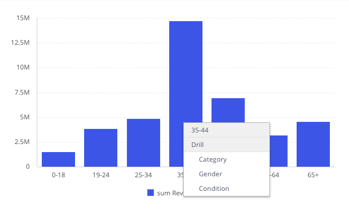
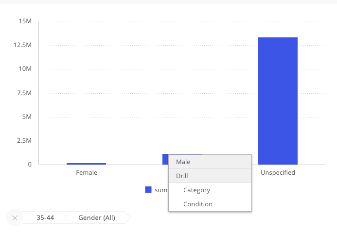

# Function DrilldownWidget

> **DrilldownWidget**(`props`): `Promise`\< `ReactNode` \> \| `ReactNode`

React component designed to add drilldown functionality to any type of chart.

This component acts as a wrapper around a given chart component, enhancing it with drilldown capabilities.

The widget offers several features including:
- A context menu for initiating drilldown actions (can be provided as a custom component)
- Breadcrumbs that not only allow for drilldown selection slicing but also
provide an option to clear the selection (can be provided as a custom component)
- Filters specifically created for drilldown operation
- An option to navigate to the next drilldown dimension

When an `initialDimension` is specified, the `drilldownDimension` will automatically inherit its
value, even before any points on the chart are selected.
This allows for complete control over the chart's dimensions to be handed over to the `DrilldownWidget`.

## Parameters

| Parameter | Type | Description |
| :------ | :------ | :------ |
| `props` | [`DrilldownWidgetProps`](../interfaces/interface.DrilldownWidgetProps.md) | DrilldownWidget properties |

## Returns

`Promise`\< `ReactNode` \> \| `ReactNode`

DrilldownWidget wrapper component

## Example

A column chart displaying total revenue by category from the Sample ECommerce data model. The chart can be drilled down by age range, gender, and condition.

```ts
import { measureFactory } from '@sisense/sdk-data';
import { Chart, DataPoint, DrilldownWidget } from '@sisense/sdk-ui';
import * as DM from './sample-ecommerce';

const CodeExample = () => (
  <DrilldownWidget
    drilldownPaths={[DM.Category.Category, DM.Commerce.Gender, DM.Commerce.Condition]}
    initialDimension={DM.Commerce.AgeRange}
  >
    {({ drilldownFilters, drilldownDimension, onDataPointsSelected, onContextMenu }) => {
      const onPointsSelected = (points: DataPoint[], nativeEvent: MouseEvent) => {
        onDataPointsSelected(points, nativeEvent);
        onContextMenu({ left: nativeEvent.clientX, top: nativeEvent.clientY });
      };

      const onPointClick = (point: DataPoint, event: MouseEvent) => {
        onDataPointsSelected([point], event);
        onContextMenu({ left: event.clientX, top: event.clientY });
      };

      return (
        <Chart
          dataSet={DM.DataSource}
          chartType={'column'}
          dataOptions={{
            category: [drilldownDimension],
            value: [measureFactory.sum(DM.Commerce.Revenue)],
            breakBy: [],
          }}
          filters={drilldownFilters}
          onDataPointsSelected={onPointsSelected}
          onDataPointContextMenu={onPointClick}
        />
      );
    }}
  </DrilldownWidget>
);

export default CodeExample;
```



Variant with the breadcrumbs rendered separately from the chart, via `isBreadcrumbsDetached`:

```ts
import { measureFactory } from '@sisense/sdk-data';
import { Chart, DataPoint, DrilldownBreadcrumbs, DrilldownWidget } from '@sisense/sdk-ui';
import * as DM from './sample-ecommerce';

const CodeExample = () => (
  <DrilldownWidget
    drilldownPaths={[DM.Category.Category, DM.Commerce.Gender, DM.Commerce.Condition]}
    initialDimension={DM.Commerce.AgeRange}
    config={{ isBreadcrumbsDetached: true, breadcrumbsComponent: DrilldownBreadcrumbs }}
  >
    {({
      drilldownFilters,
      drilldownDimension,
      onDataPointsSelected,
      onContextMenu,
      breadcrumbsComponent,
    }) => {
      const onPointsSelected = (points: DataPoint[], nativeEvent: MouseEvent) => {
        onDataPointsSelected(points, nativeEvent);
        onContextMenu({ left: nativeEvent.clientX, top: nativeEvent.clientY });
      };

      const onPointClick = (point: DataPoint, event: MouseEvent) => {
        onDataPointsSelected([point], event);
        onContextMenu({ left: event.clientX, top: event.clientY });
      };

      return (
        <>
          <Chart
            dataSet={DM.DataSource}
            chartType={'column'}
            dataOptions={{
              category: [drilldownDimension],
              value: [measureFactory.sum(DM.Commerce.Revenue)],
              breakBy: [],
            }}
            filters={drilldownFilters}
            onDataPointsSelected={onPointsSelected}
            onDataPointContextMenu={onPointClick}
          />
          <div>{breadcrumbsComponent}</div>
        </>
      );
    }}
  </DrilldownWidget>
);

export default CodeExample;
```


