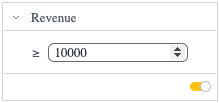

# Function CriteriaFilterTile

> **CriteriaFilterTile**(`props`): `ReactElement`\< `any`, `any` \> \| `null`

UI component that allows the user to filter numeric or text attributes according to
a number of built-in operations defined in the numeric filter, text filter, or ranking filter.

The arrangement prop determines whether the filter is rendered vertically or horizontally, with the latter intended for toolbar use and omitting title, enable/disable, and collapse/expand functionality.

## Parameters

| Parameter | Type | Description |
| :------ | :------ | :------ |
| `props` | [`CriteriaFilterTileProps`](../interfaces/interface.CriteriaFilterTileProps.md) | Criteria filter tile props |

## Returns

`ReactElement`\< `any`, `any` \> \| `null`

Criteria filter tile component

## Example

```ts
const initialRevenueFilter = filterFactory.greaterThanOrEqual(DM.Commerce.Revenue, 10000);
const [revenueFilter, setRevenueFilter] = useState<Filter | null>(initialRevenueFilter);

return (
  <CriteriaFilterTile
    title={'Revenue'}
    filter={revenueFilter}
    onUpdate={setRevenueFilter}
  />
);
```


