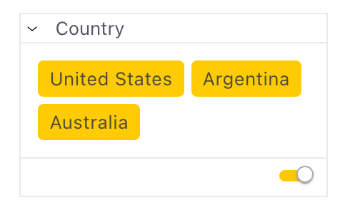

# Function MemberFilterTile

> **MemberFilterTile**(`props`): `ReactElement`\< `any`, `any` \> \| `null`

UI component that allows the user to select members to include/exclude in a
filter. A query is executed against the provided data source to fetch
all members that are selectable.

## Parameters

| Parameter | Type | Description |
| :------ | :------ | :------ |
| `props` | [`MemberFilterTileProps`](../interfaces/interface.MemberFilterTileProps.md) | Member filter tile props |

## Returns

`ReactElement`\< `any`, `any` \> \| `null`

Member filter tile component

## Example

Below is an example for filtering countries in the `Country` dimension of the `Sample ECommerce` data model.
```ts
const [countryFilter, setCountryFilter] = useState<Filter | null>(null);

return (
<MemberFilterTile
  title={'Country'}
  attribute={DM.Country.Country}
  filter={countryFilter}
  onChange={setCountryFilter}
/>
);
```


