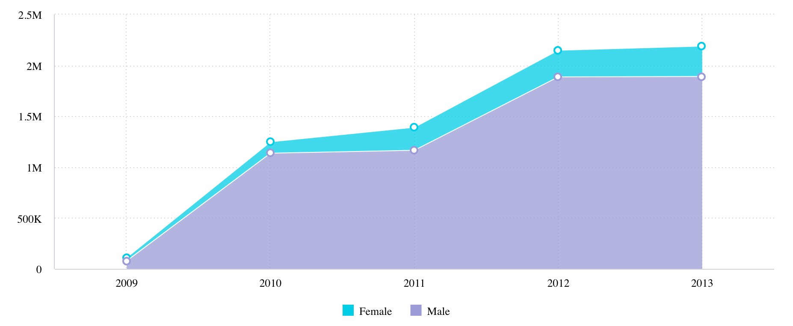

# Function AreaChart

> **AreaChart**(`props`, `context`?): `null` \| `ReactElement`\< `any`, `any` \>

A React component similar to a [LineChart](function.LineChart.md),
but with filled in areas under each line and an option to display them as stacked.
More info on [Sisense Documentation page](https://docs.sisense.com/main/SisenseLinux/area-chart.htm).

## Parameters

| Parameter | Type | Description |
| :------ | :------ | :------ |
| `props` | [`AreaChartProps`](../interfaces/interface.AreaChartProps.md) | Area chart properties |
| `context`? | `any` | - |

## Returns

`null` \| `ReactElement`\< `any`, `any` \>

Area Chart component

## Example

An example of using the component to visualize the `Sample ECommerce` data source:
```ts
<AreaChart
  dataSet={DM.DataSource}
  dataOptions={{
    category: [DM.Commerce.Date.Years],
    value: [measureFactory.sum(DM.Commerce.Revenue)],
    breakBy: [DM.Commerce.Gender],
  }}
  styleOptions={{ subtype: 'area/stacked' }}
  filters={[filterFactory.members(DM.Commerce.Gender, ['Female', 'Male'])]}
  onDataPointClick={(point, nativeEvent) => {
    console.log('clicked', point, nativeEvent);
  }}
/>
```


