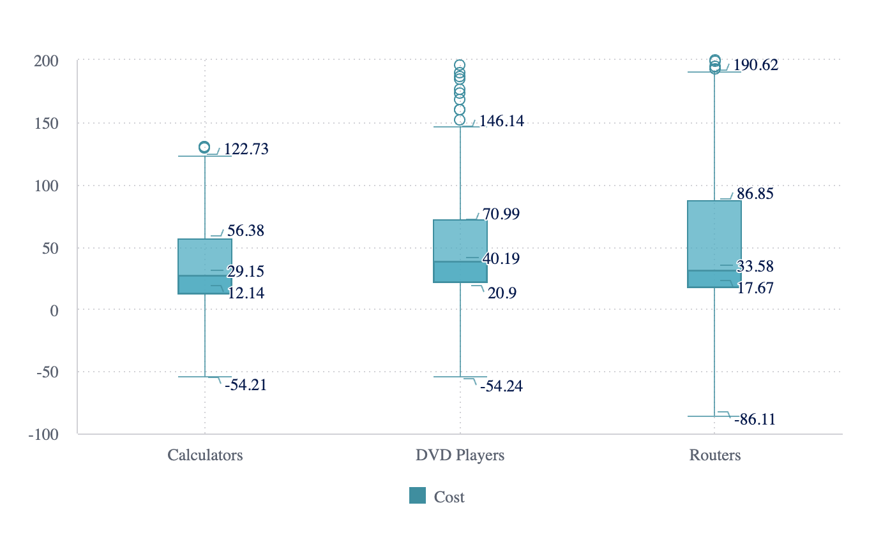

# Function BoxplotChart

> **BoxplotChart**(`props`, `context`?): `null` \| `ReactElement`\< `any`, `any` \>

A React component representing data in a way that visually describes the distribution, variability,
and center of a data set along an axis.
See [Boxplot Chart](https://docs.sisense.com/main/SisenseLinux/box-and-whisker-plot.htm) for more information.

This component is still in beta.

## Parameters

| Parameter | Type | Description |
| :------ | :------ | :------ |
| `props` | [`BoxplotChartProps`](../interfaces/interface.BoxplotChartProps.md) | Boxplot chart properties |
| `context`? | `any` | - |

## Returns

`null` \| `ReactElement`\< `any`, `any` \>

Boxplot Chart component

## Example

An example of using the component to visualize the `Sample ECommerce` data source:
```ts
<BoxplotChart
  dataSet={DM.DataSource}
  dataOptions={{
    category: [DM.Category.Category],
    value: [DM.Commerce.Cost],
    boxType: 'iqr',
    outliersEnabled: true,
  }}
  filters={[
    filterFactory.members(DM.Category.Category, ['Calculators', 'DVD Players', 'Routers']),
    filterFactory.members(DM.Commerce.AgeRange, ['19-24']),
  ]}
  styleOptions={{
    seriesLabels: {
      enabled: true,
    }
  }}
/>
```


