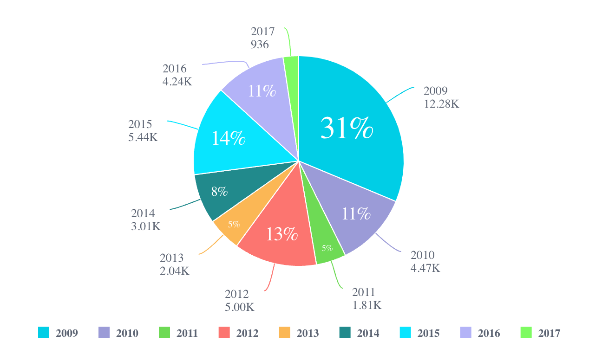

# Function Chart

> **Chart**(`props`, `context`?): `null` \| `ReactElement`\< `any`, `any` \>

A React component used for easily switching chart types or rendering multiple series of different chart types.

## Parameters

| Parameter | Type | Description |
| :------ | :------ | :------ |
| `props` | [`ChartProps`](../interfaces/interface.ChartProps.md) | Chart properties |
| `context`? | `any` | - |

## Returns

`null` \| `ReactElement`\< `any`, `any` \>

Chart component representing a chart type as specified in `ChartProps.`[chartType](../interfaces/interface.ChartProps.md#charttype)

## Example

(1) An example of using the `Chart` component to
plot a column chart of the Sample ECommerce data source hosted in a Sisense instance:
```ts
<Chart
  chartType={'column'}
  dataSet={DM.DataSource}
  dataOptions={{
    category: [DM.Commerce.AgeRange],
    value: [measures.sum(DM.Commerce.Revenue)],
    breakBy: [DM.Commerce.Gender],
  }}
  filters={[filters.members(DM.Commerce.Gender,['Female', 'Male'])]}
  onDataPointClick= {(point, nativeEvent) => { console.log('clicked', point, nativeEvent); }}
/>
```


(2) An example of using the `Chart` component to
plot a pie chart of static data provided in code:
```ts
<Chart
   chartType={'pie'}
   dataSet={{
     columns: [
       { name: 'Years', type: 'date' },
       { name: 'Group', type: 'string' },
       { name: 'Quantity', type: 'number' },
       { name: 'Units', type: 'number' },
     ],
     rows: [
       ['2009', 'A', 6781, 10],
       ['2009', 'B', 5500, 15],
       ['2010', 'A', 4471, 70],
       ['2011', 'B', 1812, 50],
       ['2012', 'B', 5001, 60],
       ['2013', 'A', 2045, 40],
       ['2014', 'B', 3010, 90],
       ['2015', 'A', 5447, 80],
       ['2016', 'B', 4242, 70],
       ['2017', 'B', 936, 20],
     ],
   }}
   dataOptions={{
     category: [
       {
         name: 'Years',
         type: 'date',
       },
     ],
     value: [
       {
         name: 'Quantity',
         aggregation: 'sum',
         title: 'Total Quantity',
       },
     ],
   }}
   styleOptions={{
     legend: {
       enabled: true,
       position: 'bottom',
     },
   }}
 />
```


