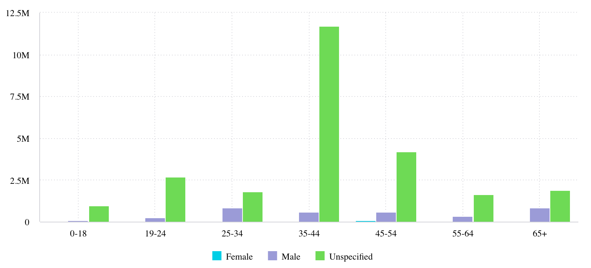

# Function ColumnChart

> **ColumnChart**(`props`, `context`?): `null` \| `ReactElement`\< `any`, `any` \>

A React component representing categorical data with vertical rectangular bars
whose heights are proportional to the values that they represent.
See [Column Chart](https://docs.sisense.com/main/SisenseLinux/column-chart.htm) for more information.

## Parameters

| Parameter | Type | Description |
| :------ | :------ | :------ |
| `props` | [`ColumnChartProps`](../interfaces/interface.ColumnChartProps.md) | Column chart properties |
| `context`? | `any` | - |

## Returns

`null` \| `ReactElement`\< `any`, `any` \>

Column Chart component

## Example

An example of using the component to visualize the `Sample ECommerce` data source:
```ts
<ColumnChart
  dataSet={DM.DataSource}
  dataOptions={{
    category: [DM.Commerce.AgeRange],
    value: [measures.sum(DM.Commerce.Revenue)],
    breakBy: [DM.Commerce.Gender],
  }}
  filters={[filters.greaterThan(DM.Commerce.Revenue, 1000)]}
  onDataPointClick={(point, nativeEvent) => {
    console.log('clicked', point, nativeEvent);
  }}
/>
```


