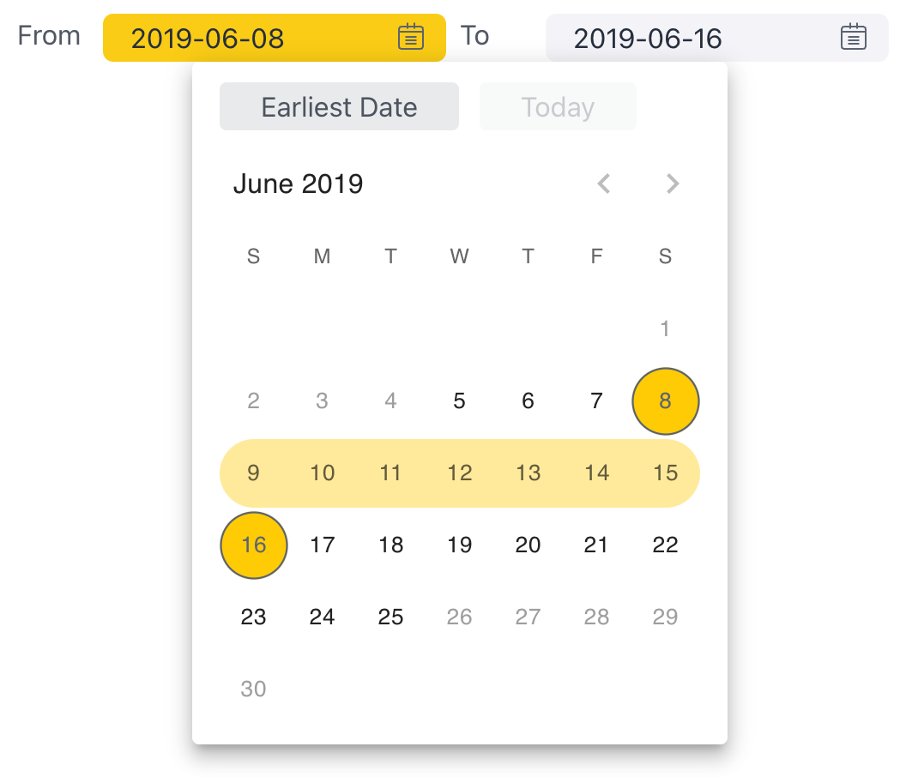

# Function DateRangeFilterTile

> **DateRangeFilterTile**(`props`, `context`?): `null` \| `ReactElement`\< `any`, `any` \>

Date Range Filter Tile component for filtering data by date range.

## Parameters

| Parameter | Type | Description |
| :------ | :------ | :------ |
| `props` | [`DateRangeFilterTileProps`](../interfaces/interface.DateRangeFilterTileProps.md) | Date Range Filter Tile Props |
| `context`? | `any` | - |

## Returns

`null` \| `ReactElement`\< `any`, `any` \>

Date Range Filter Tile component

## Example

React example of configuring the date min max values and handling onChange event.
```ts
const [dateRangeFilter, setDateRangeFilter] = useState<Filter>(
  filterFactory.dateRange(DM.Commerce.Date.Years),
);

return (
  <DateRangeFilterTile
    title="Date Range"
    attribute={DM.Commerce.Date.Years}
    filter={dateRangeFilter}
    onChange={(filter: Filter) => {
      setDateRangeFilter(filter);
    }}
  />
);
```


