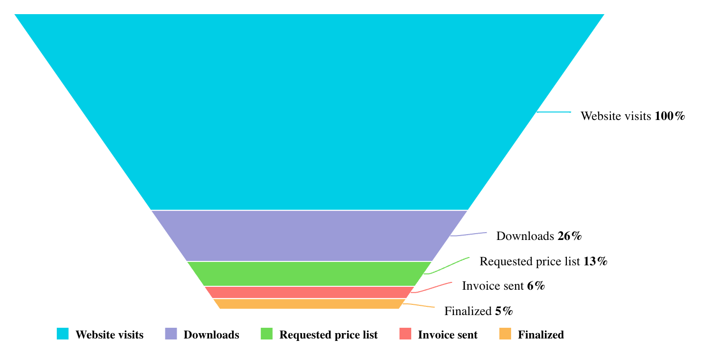

# Function FunnelChart

> **FunnelChart**(`props`, `context`?): `null` \| `ReactElement`\< `any`, `any` \>

A React component representing data progressively decreasing in size or quantity through a conical shape.
See [Funnel Chart](https://docs.sisense.com/main/SisenseLinux/funnel-chart.htm) for more information.

## Parameters

| Parameter | Type | Description |
| :------ | :------ | :------ |
| `props` | [`FunnelChartProps`](../interfaces/interface.FunnelChartProps.md) | Funnel chart properties |
| `context`? | `any` | - |

## Returns

`null` \| `ReactElement`\< `any`, `any` \>

Funnel Chart component

## Example

An example of visualizing sales funnel data:
```ts
<FunnelChart
  dataSet={{
    columns: [
      { name: 'Stage', type: 'string' },
      { name: 'Unique Users', type: 'number' },
    ],
    rows: [
      ['Website visits', 15654],
      ['Downloads', 4064],
      ['Requested price list', 1987],
      ['Invoice sent', 976],
      ['Finalized', 846],
    ],
  }}
  dataOptions={{
    category: [
      {
        name: 'Stage',
        type: 'string',
      },
    ],
    value: [
      {
        name: 'Unique Users',
        aggregation: 'sum',
      },
    ],
  }}
/>
```



Note that the chart sorts the measure, `Unique Users`, in descending order by default.
