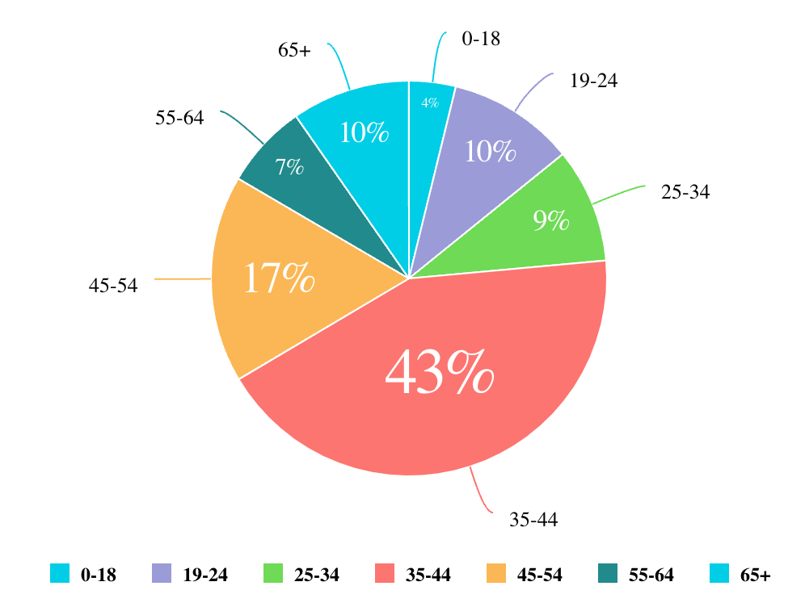

# Function PieChart

> **PieChart**(`props`, `context`?): `null` \| `ReactElement`\< `any`, `any` \>

A React component representing data in circular graph with the data shown as slices of a whole,
with each slice representing a proportion of the total.
See [Pie Chart](https://docs.sisense.com/main/SisenseLinux/pie-chart.htm) for more information.

## Parameters

| Parameter | Type | Description |
| :------ | :------ | :------ |
| `props` | [`PieChartProps`](../interfaces/interface.PieChartProps.md) | Pie chart properties |
| `context`? | `any` | - |

## Returns

`null` \| `ReactElement`\< `any`, `any` \>

Pie Chart component

## Example

An example of using the component to visualize the `Sample ECommerce` data source:
```ts
<PieChart
  dataSet={DM.DataSource}
  dataOptions={{
    category: [DM.Commerce.AgeRange],
    value: [measures.sum(DM.Commerce.Revenue)],
  }}
  filters={[filters.greaterThan(DM.Commerce.Revenue, 1000)]}
  onDataPointClick= {(point, nativeEvent) => {
    console.log('clicked', point, nativeEvent);
  }}
/>
```
###

