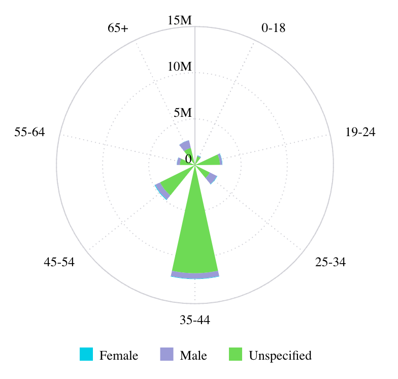

# Function PolarChart

> **PolarChart**(`props`, `context`?): `null` \| `ReactElement`\< `any`, `any` \>

A React component comparing multiple categories/variables with a spacial perspective in a radial chart.
See [Polar Chart](https://docs.sisense.com/main/SisenseLinux/polar-chart.htm) for more information.

## Parameters

| Parameter | Type | Description |
| :------ | :------ | :------ |
| `props` | [`PolarChartProps`](../interfaces/interface.PolarChartProps.md) | Polar chart properties |
| `context`? | `any` | - |

## Returns

`null` \| `ReactElement`\< `any`, `any` \>

Polar Chart component

## Example

An example of using the component to visualize the `Sample ECommerce` data source:
```ts
<PolarChart
  dataSet={DM.DataSource}
  dataOptions={{
    category: [DM.Commerce.AgeRange],
    value: [measureFactory.sum(DM.Commerce.Revenue)],
    breakBy: [DM.Commerce.Gender],
  }}
  filters={[filterFactory.greaterThan(DM.Commerce.Revenue, 1000)]}
  onDataPointClick= {(point, nativeEvent) => {
    console.log('clicked', point, nativeEvent);
  }}
/>
```


