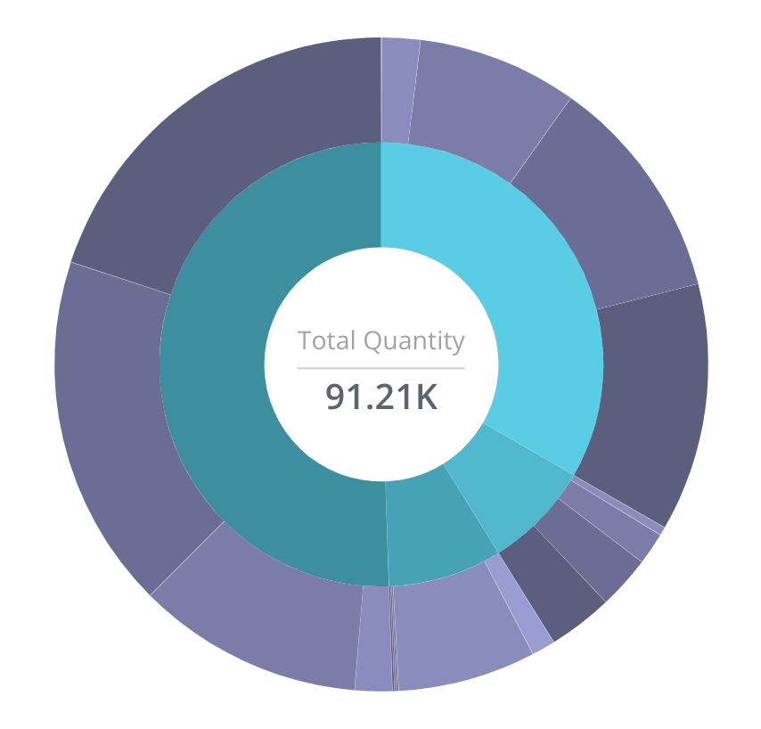

# Function SunburstChart

> **SunburstChart**(`props`, `context`?): `null` \| `ReactElement`\< `any`, `any` \>

A React component displaying hierarchical data in the form of nested circle slices.
This type of chart can be used in different scenarios, for example, to compare both categories and sub-categories.
See [Sunburst Chart](https://docs.sisense.com/main/SisenseLinux/sunburst-widget.htm) for more information.

## Parameters

| Parameter | Type | Description |
| :------ | :------ | :------ |
| `props` | [`SunburstChartProps`](../interfaces/interface.SunburstChartProps.md) | Sunburst chart properties |
| `context`? | `any` | - |

## Returns

`null` \| `ReactElement`\< `any`, `any` \>

Sunburst Chart component

## Example

An example of using the component to visualize the `Sample ECommerce` data source:
```ts
<SunburstChart
  dataSet={DM.DataSource}
  dataOptions={{
    category: [
       DM.Commerce.Сondition,
       DM.Commerce.Date.Years
     ],
    value: [measureFactory.sum(DM.Commerce.Quantity)],
  }}
/>
```


