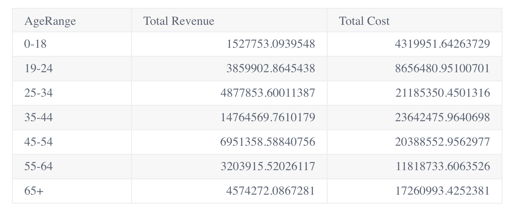

# Function Table

> **Table**(`props`, `context`?): `null` \| `ReactElement`\< `any`, `any` \>

Table with aggregation and pagination.

## Parameters

| Parameter | Type | Description |
| :------ | :------ | :------ |
| `props` | [`TableProps`](../interfaces/interface.TableProps.md) | Table properties |
| `context`? | `any` | - |

## Returns

`null` \| `ReactElement`\< `any`, `any` \>

Table component

## Example

(1) Example of Table of raw data from the `Sample ECommerce` data model:

```ts
<Table
  dataSet={DM.DataSource}
  dataOptions={{
    columns: [
      DM.Commerce.AgeRange,
      DM.Commerce.Revenue,
      DM.Commerce.Cost,
      DM.Commerce.Quantity,
    ],
  }}
  styleOptions={{ width: 600, height: 750 }}
/>
```
###


(2) Example of Table of aggregated data from the same data model:

```ts
<Table
  dataSet={DM.DataSource}
  dataOptions={{
    columns: [
      DM.Commerce.AgeRange,
      measures.sum(DM.Commerce.Revenue, 'Total Revenue'),
      measures.sum(DM.Commerce.Cost, 'Total Cost'),
    ],
  }}
  styleOptions={{
    headersColor: true,
    alternatingColumnsColor: false,
    alternatingRowsColor: true,
  }}
/>
```
###

