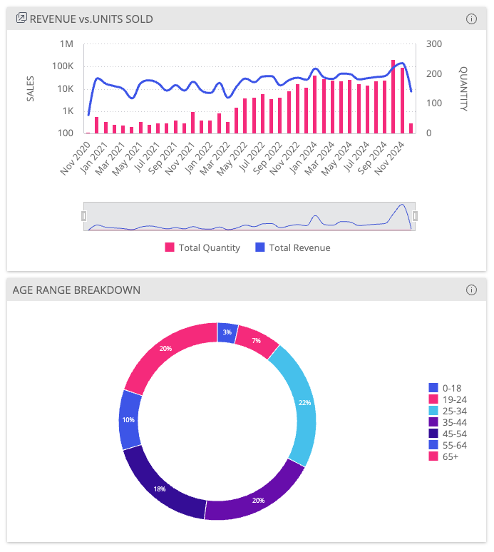

# Function WidgetById <Badge type="fusionEmbed" text="Fusion Embed" />

> **WidgetById**(`props`): `Promise`\< `ReactNode` \> \| `ReactNode`

The WidgetById component, which is a thin wrapper on the [ChartWidget](../dashboards/function.ChartWidget.md) component,
is used to render a widget created in a Sisense Fusion instance.

To learn more about using Sisense Fusion Widgets in Compose SDK,
see [Sisense Fusion Widgets](/guides/sdk/guides/charts/guide-fusion-widgets.html).

**Note:** Widget extensions based on JS scripts and add-ons in Fusion are not supported.

## Parameters

| Parameter | Type |
| :------ | :------ |
| `props` | [`WidgetByIdProps`](../interfaces/interface.WidgetByIdProps.md) |

## Returns

`Promise`\< `ReactNode` \> \| `ReactNode`

## Example

Display two dashboard widgets from a Fusion instance.

```ts
import { WidgetById } from '@sisense/sdk-ui';

const CodeExample = () => (
  <>
    <WidgetById
      dashboardOid="65a82171719e7f004018691c"
      widgetOid="65a82171719e7f0040186924"
      includeDashboardFilters={true}
      styleOptions={{ height: 380 }}
    />
    <WidgetById
      dashboardOid="65a82171719e7f004018691c"
      widgetOid="65a82171719e7f004018691f"
      styleOptions={{ height: 380 }}
    />
  </>
);

export default CodeExample;
```


