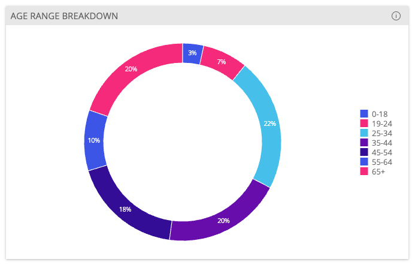
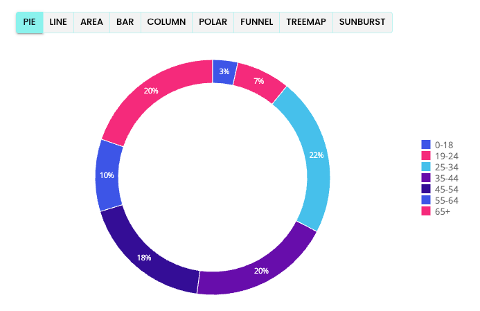

# Function useGetWidgetModel <Badge type="fusionEmbed" text="Fusion Embed" />

> **useGetWidgetModel**(...`args`): [`WidgetModelState`](../type-aliases/type-alias.WidgetModelState.md)

React hook that retrieves an existing widget model from a Fusion instance.

**Note:** Widget extensions based on JS scripts and add-ons in Fusion are not supported.

## Parameters

| Parameter | Type |
| :------ | :------ |
| ...`args` | [[`GetWidgetModelParams`](../interfaces/interface.GetWidgetModelParams.md)] |

## Returns

[`WidgetModelState`](../type-aliases/type-alias.WidgetModelState.md)

Widget load state that contains the status of the execution, the result widget model, or the error if one has occurred

## Example

Retrieve a widget model and use it to populate a `ChartWidget` component.

```ts
import { ChartWidget, useGetWidgetModel, widgetModelTranslator } from '@sisense/sdk-ui';

const CodeExample = () => {
  const { widget } = useGetWidgetModel({
    dashboardOid: '65a82171719e7f004018691c',
    widgetOid: '65a82171719e7f004018691f',
  });

  const widgetProps = widget ? widgetModelTranslator.toChartWidgetProps(widget) : null;

  return (
    <>
      {widgetProps && (
        <ChartWidget
          chartType={widgetProps.chartType}
          title={widgetProps.title}
          description={widgetProps.description}
          dataSource={widgetProps.dataSource}
          dataOptions={widgetProps.dataOptions}
          styleOptions={widgetProps.styleOptions}
          filters={widgetProps.filters}
          highlights={widgetProps.highlights}
          drilldownOptions={widgetProps.drilldownOptions}
        />
      )}
    </>
  );
};

export default CodeExample;
```



Retrieve a widget model and let the user switch its chart type at runtime:

```ts
import Button from '@mui/material/Button';
import ButtonGroup from '@mui/material/ButtonGroup';
import { Chart, ChartProps, ChartType, useGetWidgetModel, widgetModelTranslator } from '@sisense/sdk-ui';
import { useState } from 'react';

const CHART_TYPES: readonly ChartType[] = ['pie', 'line', 'area', 'bar', 'column', 'polar', 'funnel', 'treemap', 'sunburst'];

const CodeExample = () => {
  const { widget } = useGetWidgetModel({
    dashboardOid: '65a82171719e7f004018691c',
    widgetOid: '65a82171719e7f004018691f',
  });

  const [chartProps, setChartProps] = useState<ChartProps>();

  if (widget && !chartProps) setChartProps(widgetModelTranslator.toChartProps(widget));

  const changeChartType = (value: ChartType) => {
    if (value && chartProps) {
      setChartProps({
        ...chartProps,
        chartType: value,
        dataOptions: {
          // Fusion widget may not have all required data options.
          ...{ category: [], value: [], breakBy: [] },
          ...chartProps.dataOptions,
        },
        styleOptions: {
          ...chartProps.styleOptions,
          // Changing chart type may invalidate the chart subtype.
          subtype: undefined,
        },
      });
    }
  };

  return (
    <>
      {chartProps && (
        <>
          <ButtonGroup variant="outlined" size="small" color="primary">
            {CHART_TYPES.map((chartType) => (
              <Button
                key={chartType}
                size="small"
                variant={chartType === chartProps.chartType ? 'contained' : 'outlined'}
                onClick={() => changeChartType(chartType)}
              >
                {chartType}
              </Button>
            ))}
          </ButtonGroup>
          <Chart
            chartType={chartProps.chartType}
            dataSet={chartProps.dataSet}
            dataOptions={chartProps.dataOptions}
            filters={chartProps.filters}
            highlights={chartProps.highlights}
            styleOptions={chartProps.styleOptions}
          />
        </>
      )}
    </>
  );
};

export default CodeExample;
```


