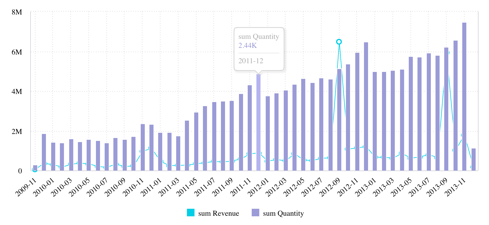

# Interface StyledColumn

Wrapped [Column](../../sdk-data/interfaces/interface.Column.md) with styles controlling how the column is visualized in a chart.

## Example

An example of using `StyledColumn` to change the date format of the months displayed on the x-axis.

```ts
<Chart
  dataSet={DM.DataSource}
  chartType={'line'}
  dataOptions={{
    category: [
      {
        column: DM.Commerce.Date.Months,
        dateFormat: 'yy-MM',
      },
    ],
    value: [
      measureFactory.sum(DM.Commerce.Revenue),
      {
        column: measureFactory.sum(DM.Commerce.Quantity),
        showOnRightAxis: true,
        chartType: 'column',
      },
    ],
    breakBy: [],
  }}
/>
```



Also, see [StyledMeasureColumn](interface.StyledMeasureColumn.md).

## Properties

### color

> **color**?: [`DataColorOptions`](../type-aliases/type-alias.DataColorOptions.md)

All possible color options for data.

***

### column

> **column**: [`Column`](../../sdk-data/interfaces/interface.Column.md)

Wrapped Column

***

### continuous

> **continuous**?: `boolean`

Boolean flag to toggle continuous timeline on this date column.

***

### dateFormat

> **dateFormat**?: `string`

Date format.

See [ECMAScript Date Time String Format](https://tc39.es/ecma262/multipage/numbers-and-dates.html#sec-date-time-string-format)

Note that 'YYYY' and 'DD' have been disabled since they often get confused with 'yyyy' and 'dd'
and can produce unexpected results.

***

### geoLevel

> **geoLevel**?: [`ScattermapLocationLevel`](../type-aliases/type-alias.ScattermapLocationLevel.md)

Geographic location level for Scattermap chart.

***

### granularity

> **granularity**?: `string`

Date granularity that works with continuous timeline.

Values from [@sisense/sdk-data!DateLevels](../../sdk-data/variables/variable.DateLevels.md).

***

### includeSubTotals

> **includeSubTotals**?: `boolean`

Boolean flag whether to include subtotals for this dimension in the pivot table.

***

### isColored

> **isColored**?: `boolean`

***

### isHtml

> **isHtml**?: `boolean`

Boolean flag whether to render category/column value as HTML in the Table component.

***

### numberFormatConfig

> **numberFormatConfig**?: [`NumberFormatConfig`](../type-aliases/type-alias.NumberFormatConfig.md)

Configuration for number formatting.

***

### sortType

> **sortType**?: [`PivotRowsSort`](../type-aliases/type-alias.PivotRowsSort.md) \| [`SortDirection`](../type-aliases/type-alias.SortDirection.md)

Sorting configuration that represents either [SortDirection](../type-aliases/type-alias.SortDirection.md) or [PivotRowsSort](../type-aliases/type-alias.PivotRowsSort.md) for the pivot table
