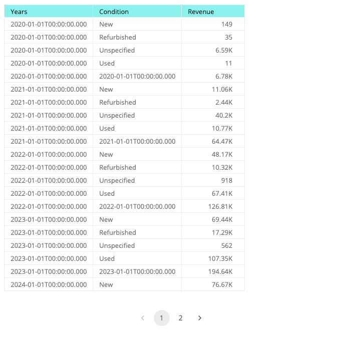

# Function useExecutePivotQuery

> **useExecutePivotQuery**(...`args`): [`PivotQueryState`](../type-aliases/type-alias.PivotQueryState.md)

React hook that executes a data query for a pivot table.
This approach is similar to React Query's `useQuery` hook.

## Parameters

| Parameter | Type |
| :------ | :------ |
| ...`args` | [[`ExecutePivotQueryParams`](../interfaces/interface.ExecutePivotQueryParams.md)] |

## Returns

[`PivotQueryState`](../type-aliases/type-alias.PivotQueryState.md)

Query state that contains the status of the query execution, the result data, or the error if any occurred

## Example

Execute a pivot query on the Sample ECommerce data model and display the results in a table.

```ts
import { Table, useExecutePivotQuery, ExecutePivotQueryParams } from '@sisense/sdk-ui';
import { measureFactory, Sort } from '@sisense/sdk-data';
import * as DM from './sample-ecommerce';

const CodeExample = () => {
  const pivotQueryProps: ExecutePivotQueryParams = {
    dataSource: DM.DataSource,
    rows: [
      { attribute: DM.Commerce.Date.Years.sort(Sort.None), includeSubTotals: true },
      { attribute: DM.Commerce.Condition, includeSubTotals: false },
    ],
    values: [measureFactory.count(DM.Commerce.Revenue, 'Revenue').sort(Sort.Descending)],
    grandTotals: { rows: true },
  };

  const { data: pivotData, isLoading } = useExecutePivotQuery(pivotQueryProps);

  return (
    <>
      {isLoading && <div>Loading...</div>}
      {pivotData && (
        <Table
          dataSet={pivotData.table}
          dataOptions={{ columns: pivotData.table.columns }}
          styleOptions={{ rowsPerPage: 21, height: 650 }}
        />
      )}
    </>
  );
};

export default CodeExample;
```


