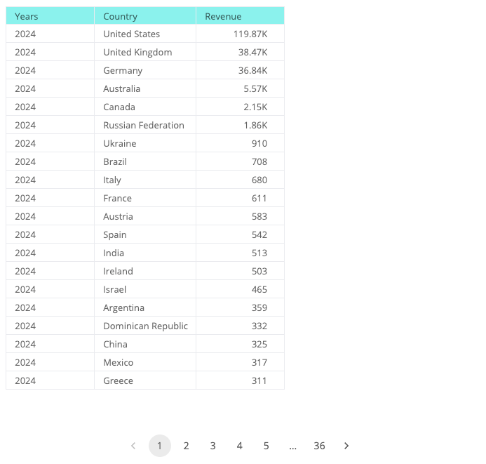

# Function useExecuteQuery

> **useExecuteQuery**(...`args`): [`ExecuteQueryResult`](../type-aliases/type-alias.ExecuteQueryResult.md)

React hook that executes a data query.

This approach, which offers an alternative to the [ExecuteQuery](function.ExecuteQuery.md) component, is similar to React Query's `useQuery` hook.

## Parameters

| Parameter | Type |
| :------ | :------ |
| ...`args` | [[`ExecuteQueryParams`](../interfaces/interface.ExecuteQueryParams.md)] |

## Returns

[`ExecuteQueryResult`](../type-aliases/type-alias.ExecuteQueryResult.md)

Query state that contains the status of the query execution, the result data, or the error if any occurred

## Example

Execute a query to retrieve revenue per country per year from the Sample ECommerce data model, sorted by revenue and year, and display the data in a table.

```ts
import { Table, useExecuteQuery } from '@sisense/sdk-ui';
import { measureFactory, Sort } from '@sisense/sdk-data';
import * as DM from './sample-ecommerce';

const CodeExample = () => {
  const { data } = useExecuteQuery({
    dataSource: DM.DataSource,
    dimensions: [DM.Commerce.Date.Years.sort(Sort.Descending), DM.Country.Country],
    measures: [measureFactory.count(DM.Commerce.Revenue, 'Revenue').sort(Sort.Descending)],
  });

  return (
    <>
      {data && (
        <Table
          dataSet={data}
          dataOptions={{ columns: data.columns }}
          styleOptions={{ rowsPerPage: 20, height: 650 }}
        />
      )}
    </>
  );
};

export default CodeExample;
```



See also: [Take Control of Your Data Visualizations](https://www.sisense.com/blog/take-control-of-your-data-visualizations/),
a blog post with examples of using the hook to fetch data to display in third-party charts.
