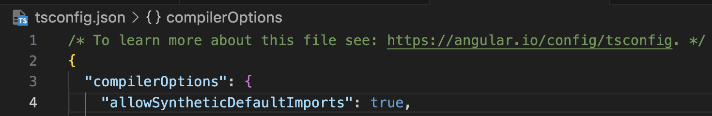
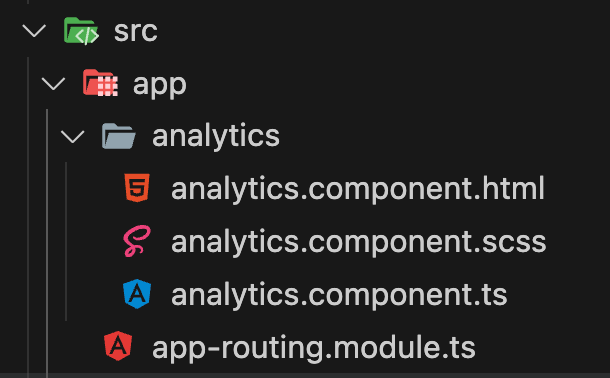
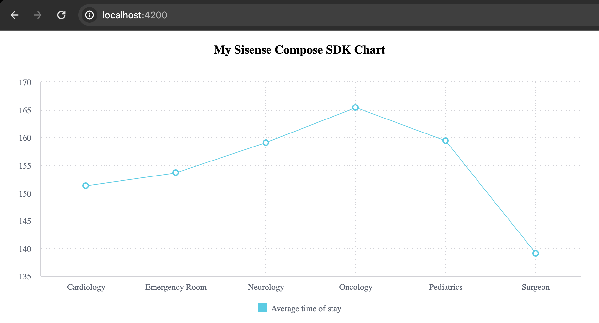

# Compose SDK with Angular <Badge type="beta" text="Beta" />: Quickstart Guide

Follow this guide to get started developing applications with Compose SDK.

>**Note**:
This guide is for [ Angular](./quickstart-angular) (beta). We also have a Quickstart Guide for [ React](./quickstart) and [ Vue](./quickstart-vue) (beta).

## Prerequisites

Compose SDK contains a set of components needed to interface with your Sisense instance. The following prerequisites are needed in order to use the SDK:

1. Familiarity with [front-end web development](https://developer.mozilla.org/en-US/docs/Learn/Front-end_web_developer), including Node.js, JavaScript/TypeScript, and Angular.
2. [Node.js](https://nodejs.org/en) version **16.0.0** or higher.
3. [Angular](https://angular.io) version **16** or higher.
4. A Node package manager such as [npm](https://docs.npmjs.com/downloading-and-installing-node-js-and-npm) or [Yarn](https://yarnpkg.com/getting-started/install).
5. Access to a [Sisense](https://sisense.com) instance with a queryable data source (for example, Sample Healthcare).
6. Angular application **with TypeScript**. You can use an existing application, or if you don't have one, you can follow the [tutorial](https://angular.io/start) to create one.

>**Package manager**:
>In Angular `npm` is the default choice and this guide will also adopt `npm`.
>
>You can opt to switch to `Yarn` by following the instructions in a [blog post](https://blog.angular-university.io/getting-started-with-angular-setup-a-development-environment-with-yarn-the-angular-cli-setup-an-ide/) from Angular University.

## Quickstart Application Setup

For this quickstart guide we'll create a new Angular project using [comand line tool](https://angular.io/quick-start#create-a-new-angular-app-from-the-command-line).

If you're using an existing project, skip to [Installing the SDK packages](#installing-the-sdk-packages).

1. Create or navigate to the directory in which you want to create your Angular app.
2. Run this command to create your new Angular app.
```sh
npm init @angular compose-sdk-app
```
3. When prompted, choose to add Angular routing, then press Enter to accept the default option.
This creates a new Angular app in the `compose-sdk-app` directory.
4. Run this command to navigate to the newly created directory.
```sh
cd compose-sdk-app
```
5. Install the dependencies.
```sh
npm install
```
6. To run the application, use:
```sh
npm start
```

## Installing the SDK Packages

First, you should make some configurations to enable proper typing with TypeScript.
You can achieve this by adding the `allowSyntheticDefaultImports` flag to the `compilerOptions` section in your `tsconfig.json` file.
>**Note:** This flag does not affect the JavaScript emitted by TypeScript, it’s only for the type checking. This option brings the behavior of TypeScript in-line with Babel, where extra code is emitted to make using a default export of a module more ergonomic.



Compose SDK for Angular contains three packages for public use:

- [@sisense/sdk-ui-angular](https://www.npmjs.com/package/@sisense/sdk-ui-angular): Angular components and services for rendering charts and executing queries against a Sisense instance.
- [@sisense/sdk-data](https://www.npmjs.com/package/@sisense/sdk-data): Implementations of dimensional modeling elements including dimensions, attributes, measures, and filters.
- [@sisense/sdk-cli](https://www.npmjs.com/package/@sisense/sdk-cli): A command-line tool for generating a TypeScript representation of a Sisense data model.

The Compose SDK packages are deployed via public NPM Registry. To install `@sisense/sdk-ui-angular` and `@sisense/sdk-data` for your app:
   ```sh
   npm i @sisense/sdk-ui-angular @sisense/sdk-data
   ```

Package `@sisense/sdk-cli` is not needed to run your app. It will be installed on the fly as you execute CLI commands using [npx](https://docs.npmjs.com/cli/v10/commands/npx).

## Sisense Authentication and Security

In order to retrieve data, you need to authenticate your application with your Sisense instance and set up CORS.

### Authentication

There are a number of different ways you can authenticate your application. To learn more, see [Authentication and Security](./authentication-security.md#authentication).

Here, we'll use an API Token that we retrieve using the Compose SDK tool. To do so, run the `get-api-token` command:

```sh
npx @sisense/sdk-cli get-api-token --url <your_instance_url> --username <username>
```

Hold on to the API Token. You'll need it later when adding Compose SDK code to your application.

### CORS Settings

There are also a number of different ways you can set up CORS. To learn more, see [Authentication and Security](./authentication-security.md#cross-origin-resource-sharing-cors).

Here we'll use the Sisense UI. To do so, in your Sisense instance, go to **Admin > Security & Access > Security Settings > General** and add your application's domain to the **CORS Allowed Origins** list.

## Adding Sisense to Your Application

This section describes how to add Compose SDK to your application to render charts from data in your Sisense instance.

### Generating a Data Model Representation

To visualize data in your application using Compose SDK, first make sure you have a [data model](https://docs.sisense.com/main/SisenseLinux/introduction-to-data-models.htm?Highlight=create%20a%20data%20model%20within%20Sisense) in your Sisense instance. Then, create a TypeScript representation of it in your project. This is done using the CLI command which automatically generates it, or you can create it manually using the same syntax.

Once you have a TypeScript representation of your data model, you define measures, dimensions and filters and easily create sophisticated queries. There is no need to specify complex `JOINS` relationships or `GROUP BYS` that you do when using SQL and other query languages because the Sisense semantic [query engine](https://docs.sisense.com/main/SisenseLinux/analytical-engine-overview.htm) will do that for you.

Run the following command to create a `sample-healthcare.ts` file in directory `src/` of the application. The file contains a TypeScript representation of the Sample Healthcare data model.

```sh
npx @sisense/sdk-cli get-data-model --username "<username>" --output src/sample-healthcare.ts --dataSource "Sample Healthcare" --url <your_instance_url>
```

Enter your password to complete the command and generate the data model representation.

> **Note:**
> You can use other authentication methods such as WAT (`--wat "<your_token>"`), or API token (`--token "<your_API_token>"`) when generating the data model representation.

The resulting file, which is created in the `src/` directory, should look something like below:

```ts
import type { Dimension, DateDimension, Attribute } from '@sisense/sdk-data';
import { createAttribute, createDateDimension, createDimension } from '@sisense/sdk-data';

export const DataSource = 'Sample Healthcare';

interface AdmissionsDimension extends Dimension {
  Cost_of_admission: Attribute;
  Death: Attribute;
  Diagnosis_ID: Attribute;
  Doctor_ID: Attribute;
  HAI: Attribute;
  ID: Attribute;
  Patient_ID: Attribute;
  Room_ID: Attribute;
  SSI: Attribute;
  Surgical_Procedure: Attribute;
  TimeofStay: Attribute;
  Admission_Time: DateDimension;
  Discharge_Time: DateDimension;
}
export const Admissions = createDimension({
  name: 'Admissions',
  Cost_of_admission: createAttribute({
    name: 'Cost_of_admission',
    type: 'numeric-attribute',
    expression: '[Admissions.Cost_of_admission]',
  }),
...
```

This works for any data model, including models you create. Just replace `"Sample Healthcare"` with the name of your data model.

## Embedding a Chart in your Application

In this section, you will add a new component and modify the main app module to embed a chart visualizing data from the Sample Healthcare data source.

> **Note:**
> The following assumptions are made about your application:
>
> - The `sample-healthcare.ts` file generated earlier resides in `src/`.
> - The URL to your application (f.e. http://localhost:4200) is already added as an entry to CORS Allowed Origins section on your Sisense instance

### Connecting to a Sisense Instance

Add a Sisense provider that contains all relevant information about the Sisense instance and ensures it is available to all Compose SDK components. The authentication method used to access your Sisense instance is defined in this provider.

The following examples shows how to add a provider to `src/app/app.module.ts`.

::: tip
Full file code is available in [Adding a component and routing section](#adding-a-component-and-routing)
:::
Add the following:
- TypeScript imports:
```typescript
import { SISENSE_CONTEXT_CONFIG_TOKEN, SdkUiModule, SisenseContextConfig } from '@sisense/sdk-ui-angular';
```
- Authentication config:
```typescript
export const SISENSE_CONTEXT_CONFIG: SisenseContextConfig = {
  url: '<instance url>', // replace with the URL of your Sisense instance
  token: '<api token>', // replace with the API token of your user account
};
```
- Module import and provider:
```typescript
@NgModule({
  imports: [SdkUiModule],
  providers: [
    { provide: SISENSE_CONTEXT_CONFIG_TOKEN, useValue: SISENSE_CONTEXT_CONFIG },
  ]
...
```

> **Note:**
> The above example uses the API token (also called _bearer authentication_) to connect to a Sisense instance. To generate an API token for your Sisense user account, see the Sisense Instance Authentication section above. The provider also supports other authentication mechanisms including WAT and SSO.

### Adding a component and routing

To render a chart in your application that queries your data model, you need to create a new component that uses the data utilities along with your previously generated data model file.

Here, we'll add a new **Analytics** component with the help of the `ng` CLI tool. You can do it manually. For more information, see the [guide](https://angular.io/guide/component-overview) from Angular.

Run following in your terminal from the project directory:
```sh
npx ng generate component analytics
```
This should result in a new folder with three files inside:



Next, configure the routing and point the main page to the `Analytics` component.

The `app.module.ts` file should look like this now:
```typescript
import { NgModule } from '@angular/core';
import { BrowserModule } from '@angular/platform-browser';
import { SISENSE_CONTEXT_CONFIG_TOKEN, SdkUiModule, SisenseContextConfig } from '@sisense/sdk-ui-angular';

import { AppComponent } from './app.component';
import { RouterModule } from '@angular/router';
import { AnalyticsComponent } from './analytics/analytics.component';

export const SISENSE_CONTEXT_CONFIG: SisenseContextConfig = {
  url: '<instance url>', // replace with the URL of your Sisense instance
  token: '<api token>', // replace with the API token of your user account
};

@NgModule({
  imports: [
    BrowserModule,
    SdkUiModule,
    RouterModule.forRoot([
      { path: '', component: AnalyticsComponent },
    ]),
  ],
  declarations: [AppComponent, AnalyticsComponent],
  providers: [
    { provide: SISENSE_CONTEXT_CONFIG_TOKEN, useValue: SISENSE_CONTEXT_CONFIG },
  ],
  bootstrap: [AppComponent],
})
export class AppModule { }
```

Replace the contents of the `app.component.html` file with:
```typescript
<router-outlet></router-outlet>
```

### Adding a chart

Use the `dataOptions` property (`ChartProps` interface) to assign table columns or attributes from your data model to the categories and values of a chart. This is similar to the **Data** panel in the **Sisense Widget Editor**, where you can drag and drop columns to the **Categories**, **Values**, and **Break By** fields. For example, if you wanted to render a line chart with `Doctors' Specialty` on the X-axis and an average aggregation of `Time of Stay` on the Y-axis, your `dataOptions` object would look like:

```ts
// chartType={'line'}
{
  category: [DM.Doctors.Specialty],
  value: [measureFactory.average(DM.Admissions.TimeofStay)],
  breakBy: [],
}
```

> **Note:**
> Use `measureFactory.average()` from the example above to specify the `average` type aggregation on the `TimeofStay` category. This `measureFactory` utility is exported from the `@sisense/sdk-data` library and supports other aggregation types. See the [`measureFactory`](./modules/sdk-data/namespaces/namespace.measureFactory/index.md) documentation for more information.

The following is a complete example of a rendered chart in an application.

```ts
// src/app/analytics/analytics.component.ts

import { Component } from '@angular/core';
import { measureFactory } from '@sisense/sdk-data';
import * as DM from '../../sample-healthcare';

@Component({
  selector: 'app-analytics',
  templateUrl: './analytics.component.html',
  styleUrls: ['./analytics.component.css'],
})
export class AnalyticsComponent {
  chart = {
    chartType: 'line' as const,
    dataSet: DM.DataSource,
    dataOptions: {
      category: [DM.Doctors.Specialty],
      value: [measureFactory.average(DM.Admissions.TimeofStay, 'Average time of stay')],
      breakBy: [],
    },
    styleOptions: {
      legend: {
        enabled: true,
        position: 'bottom',
      },
    },
  };

  logArguments(...args: any[]) {
    console.log(args);
  }
}
```
```ts
// src/app/analytics/analytics.component.html

<h3 [align]="'center'">My Sisense Compose SDK Chart</h3>
<csdk-chart
    [chartType]="chart.chartType"
    [dataSet]="chart.dataSet"
    [dataOptions]="chart.dataOptions"
    [styleOptions]="chart.styleOptions"
    (dataPointClick)="logArguments($event)"
  />
```

At this point, check your application in the browser if it's already running or run `npm start` to run your application and view it in a browser.

You first Compose SDK chart with Angular should look something like this:



See the [SISENSE_CONTEXT_CONFIG_TOKEN](./modules/sdk-ui-angular/contexts/variable.SISENSE_CONTEXT_CONFIG_TOKEN.md) and [ChartComponent](./modules/sdk-ui-angular/charts/class.ChartComponent.md) docs for more details on supported props.

## Next Steps

The sample application in this quickstart guide is designed to give you a basis for what you can do with Compose SDK. Build on the code sample by using other components from Compose SDK to add Sisense analytical experiences to your applications.

Check out our demo application for Compose SDK with [Angular](https://csdk-angular.sisense.com).
