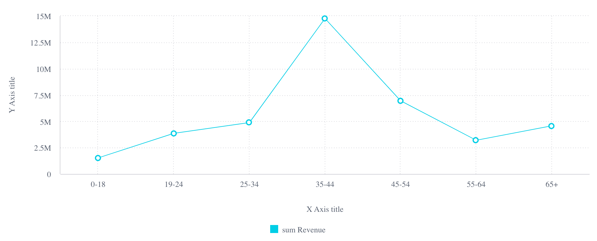

# Getting Started with Compose SDK [Beta]

## Prerequisites

Prerequisites for using Compose SDK:

1. Familiarity with [front-end web development](https://developer.mozilla.org/en-US/docs/Learn/Front-end_web_developer), including Node.js, JavaScript/TypeScript, and React.
1. Node.js version 12 or higher.
1. A Node.js version manager such as `nvm` or [Volta](https://docs.volta.sh) (recommended).
1. A package manager such as `npm` or `Yarn`.
1. Access to a Sisense instance with a queryable data source (for example, `Sample ECommerce`).
1. A sample React app **with TypeScript**. You can use your own, or if you do not have one, you can follow the [Vite tutorial](https://vitejs.dev/guide/#scaffolding-your-first-vite-project) to create one. This tutorial requires Node.js 14.18 or higher.

## Installing SDK packages

The Compose SDK packages are currently hosted on [Sisense internal Artifactory](https://artifactory.sisense.com/ui/).
In your project, you need to set up the package manager to pull packages with the `@sisense` scope
from this internal repository instead of the default for npm or Yarn.

For npm and Yarn 1 (Classic):

```sh
npm config set @sisense:registry "https://artifactory.sisense.com/artifactory/api/npm/sisense-node-modules/" --userconfig .npmrc
```

For Yarn 2+:

```sh
yarn config set npmScopes.sisense.npmRegistryServer "https://artifactory.sisense.com/artifactory/api/npm/sisense-node-modules/"
```

Now install `@sisense/sdk-ui`, `@sisense/sdk-data`, and `@sisense/sdk-cli`. Here's a quick overview of what is in each library:

- `@sisense/sdk-ui`: React components for rendering charts and executing queries against a Sisense instance.
- `@sisense/sdk-data`: Implementations of dimensional modeling elements including dimensions, attributes, measures, and filters.
- `@sisense/sdk-cli`: A command-line tool for generating TypeScript representation of a Sisense data model.

With npm:

```sh
npm i @sisense/sdk-ui @sisense/sdk-data
npm i @sisense/sdk-cli --save-dev
```

With Yarn:

```sh
yarn add @sisense/sdk-ui @sisense/sdk-data
yarn add @sisense/sdk-cli --dev
```

## Generating a data model representation

Next, you will generate the data model of a Sisense data source that your project code can reference
when building your queries and charts.
This model gives you direct access to the tables and columns in your data source,
and allows you to use them in code in a convenient and type-safe way.

You do this with the CLI tool provided by `@sisense/sdk-cli`.

Run the following command to create a `sample-ecommerce.ts` file in directory `src/` of the app.
The file contains a TypeScript representation of the **Sample ECommerce** data model.
Substitute `<username>` and `<instance url>` with the values for your instance.

With npm or Yarn:

```sh
npx sdk-cli get-data-model --username "<username>" --output src/sample-ecommerce.ts --dataSource "Sample ECommerce" --url <instance url>
```

You will be prompted for the password.

The resulting file, which is created in the `src/` directory, should look something like below:

```typescript
import {
  Dimension,
  DateDimension,
  Attribute,
  createAttribute,
  createDateDimension,
  createDimension,
} from '@sisense/sdk-data';

export const DataSource = 'Sample ECommerce';

interface BrandDimension extends Dimension {
  Brand: Attribute;
  BrandID: Attribute;
}
export const Brand = createDimension({
  name: 'Brand',
  Brand: createAttribute({
    name: 'Brand',
    type: 'text-attribute',
    expression: '[Brand.Brand]',
  }),
  BrandID: createAttribute({
    name: 'BrandID',
    type: 'numeric-attribute',
    expression: '[Brand.Brand ID]',
  }),
}) as BrandDimension;

...
```

This works for any of your own data sources. If you had an Elasticube named **"My Cool Data Source"**, you could run:

With npm or Yarn:

```sh
npx sdk-cli get-data-model --username "<username>" --output src/my-data-source.ts --dataSource "My Cool Data Source" --url <instance url>
```

> **_NOTE:_** In this example, basic authentication with username and password is used to connect to a Sisense instance.
> The CLI tool also supports other authentication mechanisms including [token authentication](https://sisense.dev/guides/rest/using-rest-api.html)
> and [Web Access Tokens (WAT)](https://docs.sisense.com/main/SisenseLinux/using-web-access-token.htm).

## Embedding a chart in your app

In this section, you will modify the main app component to embed a chart visualizing data from
the **Sample ECommerce** data source.

To that end, you will use two components, `SisenseContextProvider` and `Chart`, from `@sisense/sdk-ui`
along with the `measures` and `filters` utilities from `@sisense/sdk-data`.

> **_NOTE:_** This section makes the following assumptions about your app:
>
> - The `src/App.tsx` file is the main React component.
> - The `sample-ecommerce.ts` file generated earlier resides in `src/`.
> - The URL to your app, for example, `http://localhost:5173` (**without `/` at the end**), is already added as an entry to _[CORS](https://developer.mozilla.org/en-US/docs/Web/HTTP/CORS) Allowed Origins_
>   section on your Sisense instance. If not, you can do so on your Sisense instance by going to _Admin → Security Settings_.

### Setting up Sisense context provider to connect to a Sisense instance

The `SisenseContextProvider` component allows you to connect to a Sisense instance and provide that Sisense context
to all Compose SDK components in your application.

Add `SisenseContextProvider` to `src/App.tsx` as below. All other SDK components will be nested inside this component.

**`src/App.tsx`**

```tsx
import { SisenseContextProvider } from '@sisense/sdk-ui';

function App() {
  return (
    <>
      <SisenseContextProvider
        url="<instance url>" // replace with the URL of your Sisense instance
        token="<api token>" // replace with the API token of your user account
      ></SisenseContextProvider>
    </>
  );
}
export default App;
```

> **_NOTE:_** In this example, token authentication (also called bearer authentication) is used to connect to a Sisense instance.
> To generate an API token for your Sisense user account, refer to [this guide](https://sisense.dev/guides/rest/using-rest-api.html).
> Sisense context provider also supports other authentication mechanisms including basic authentication with username and password,
> [Web Access Tokens (WAT)](https://docs.sisense.com/main/SisenseLinux/using-web-access-token.htm), and [Single Sign-On (SSO)](https://docs.sisense.com/main/SisenseLinux/using-single-sign-on-to-access-sisense.htm).

### Rendering a chart

Use the `Chart` component from `@sisense/sdk-ui`, the `measures` and `filters` utilities from `@sisense/sdk-data`, and your previously generated data model file to render a chart that queries your data model behind the scene.

Use the `dataOptions` prop to assign table columns (or attributes) from your data model to the categories and values of a chart.
This is somewhat similar to the "Data" panel in the Sisense Widget Editor, where you can drag and drop columns to the Categories, Values, and Break By fields.
For example, if you wanted to render a `line` chart with "Age Range" on the X-axis and a sum aggregation of "Revenue" on the Y-axis, your `dataOptions` object would look like:

```text
// chartType={'line'}
{
  category: [DM.Commerce.AgeRange],
  value: [measures.sum(DM.Commerce.Revenue)],
  breakBy: [],
}
```

Note that we use `measures.sum()` above to specify the "sum" type aggregation on the "Revenue" category. This `measures` utility is exported from the `@sisense/sdk-data` library and supports various other aggregation types as well. See the [measures](./modules/_sisense_sdk_data.measures.html) documentation for more information.

Here's a full example of the code and the resulting chart:

**`src/App.tsx`**

```tsx
import { Chart, SisenseContextProvider } from '@sisense/sdk-ui';
import * as DM from './sample-ecommerce';
import { measures } from '@sisense/sdk-data';

function App() {
  return (
    <>
      <SisenseContextProvider
        url="<instance url>" // replace with the URL of your Sisense instance
        token="<api token>" // replace with the API token of your user account
      >
        <Chart
          dataSet={DM.DataSource}
          chartType={'line'}
          dataOptions={{
            category: [DM.Commerce.AgeRange],
            value: [measures.sum(DM.Commerce.Revenue)],
            breakBy: [],
          }}
          styleOptions={{
            legend: {
              enabled: true,
              position: 'bottom',
            },
          }}
          onDataPointClick={(point, nativeEvent) => {
            console.log('clicked', point, nativeEvent);
          }}
        />
      </SisenseContextProvider>
    </>
  );
}

export default App;
```



See the [SisenseContextProvider](./functions/_sisense_sdk_ui.SisenseContextProvider.html) and [Chart](./functions/_sisense_sdk_ui.Chart.html) docs for more details on supported props.
